# Arduino IDE和驱动的安装

当我们拿到开发板时，首先我们要安装Arduino IDE和驱动，相关文件我们可以在官网上找到，以下链接是包含各种系统、各种版本的Arduino IDE和驱动任你选择。

<https://www.arduino.cc/en/Main/OldSoftwareReleases#1.5.x>

下面我们介绍下Arduino-1.5.6 版本IDE在Windows系统的安装方法。

下载下来的文件是一个arduino-1.5.6-r2-windows.zip的压缩文件夹，解压出来到硬盘。

双击Arduino-1.5.6 .exe文件


然后

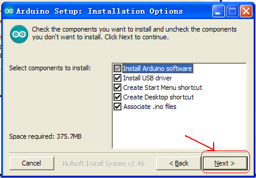

然后

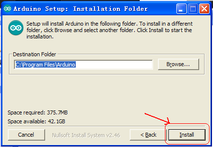

等待安装完成.点击close，安装完成。

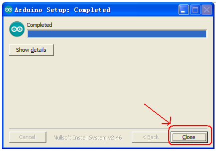

1.5.6版本安装后的样子。

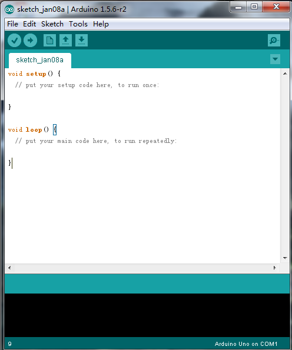

接下来是开发板驱动的安装，这次我们安装的是Keyes UNO R3开发板的驱动，Keyes 2560 R3开发板安装驱动方法和这个类似，驱动文件可以用同一个文件。

不同的系统，安装驱动的方法也有一些细小的区别，下面我们介绍在WIN 7系统安装驱动的方法。

第一次Keyes UNO R3
开发板连接电脑时，点击计算机--属性--设备管理器，显示如下图。


点击 Unknown device 安装驱动，如下图。

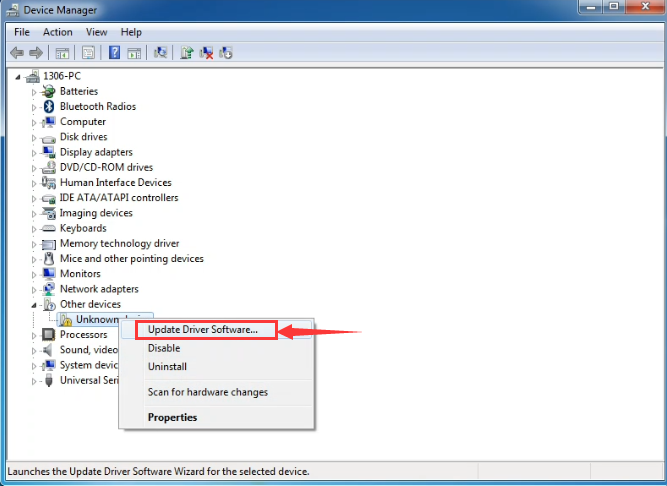

进入下图，选择


找到Arduino安装位置的drivers文件夹

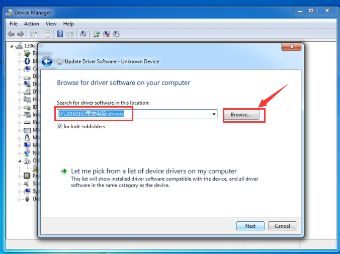

点击“Next”，今天下图选择，开始安装驱动


安装驱动完成，出现下图点击Close。

这样驱动就装好了。点击计算机--属性--设备管理器，我们可看见如下图。


# Arduino IDE的使用方法

Keyes UNO R3开发板的USB驱动安装成功之后，我们可以在Windows设备管理器中找到相应的串口。

下面示范第一个程序的烧写，串口监视器中显示“Hello World！”。

测试代码为：

```
int val;
int ledpin=13; 
void setup()
{
    Serial.begin(9600);
    pinMode(ledpin,OUTPUT);	
}
void loop()
{
    val=Serial.read();
if(val=='R')
{
    digitalWrite(ledpin,HIGH);
    delay(500);
    digitalWrite(ledpin,LOW);
    delay(500);
    Serial.println("Hello World!");
}
}
```


我们打开Arduino 的软件，编写一段程序让Keyes UNO R3开发板接受到我们发的指令就显示“Hello World！”字符串；我们再借用一下Keyes UNO R3 开发板上的 D13的指示灯，让Keyes UNO R3开发板接受到指令时指示灯闪烁一下，再显示“Hello World！”。

打开Arduino 的软件，设置板，如下。


设置COM端口，如下


点击编译程序，检查程序是否错误；点击上传程序；Keyes UNO R3 开发板设置OK后右下脚显示如下图，和设备管理器中显示一致。

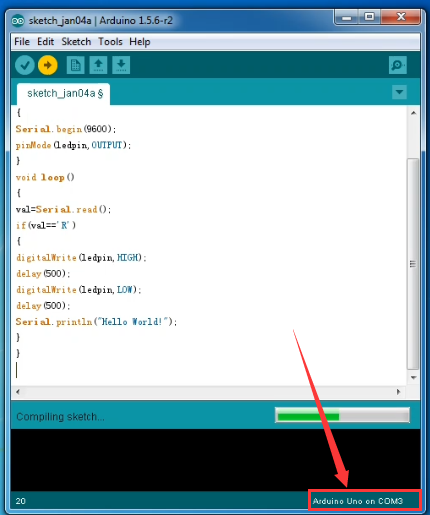

上传成功，输入R，点击发送，Keyes UNO R3 开发板上的 D13
的指示灯闪烁一次，串口监视器中显示 Hello World! 如下图

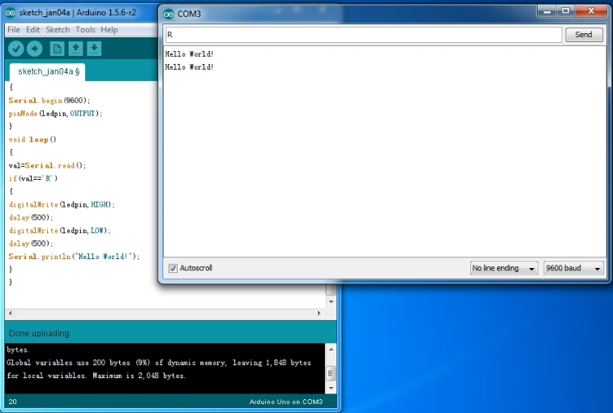

那么恭喜你，你的第一个程序已经成功了！！！

# 实验课程

## 实验一 LED 闪烁实验

实验说明

LED 闪烁实验是比较基础的实验之一，上一个“ Hello World！”实验里已经利用到了Arduino 自带的LED，这次我们利用其他I/O
口和外接直插LED 灯来完成这个实验。

实验器材

开发板\*1

USB线\*1

LED\*1

220Ω 电阻\*1

面包板\*1

面包板连接线若干

接线图

连接Keyes UNO R3


连接Keyes 2560 R3

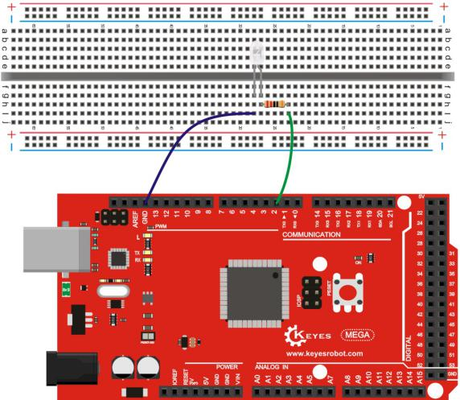

测试代码
```
int led = 2;                     //定义数字口2
void setup()
{
  pinMode(led, OUTPUT);     //设置led为输出
}
void loop()
{
  digitalWrite(led, HIGH);   //开启led
   delay(2000); //延迟2S               
  digitalWrite(led, LOW);    //关闭led
  delay(2000);//延迟2S
}
```

测试结果

下载完程序就可以看到我们的IO口外接小灯在闪烁了，这样我们的实验现象为LED不停闪烁，间隔大约为两秒。

## 实验二 呼吸灯实验

实验说明

上一课程中我们只是控制LED的亮和灭，那么我们可以怎么控制LED的亮度呢？本课程中我们把LED接到PWM口中，然后通过改变PWM数值，调节LED亮度，使LED逐渐变亮，和逐渐变暗，从而达到呼吸灯的效果。

实验器材

开发板\*1

USB线\*1

LED\*1

220Ω 电阻\*1

面包板\*1

面包板连接线若干

接线图

连接Keyes UNO R3


连接Keyes 2560 R3

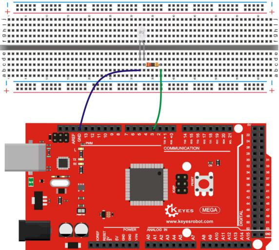

测试代码

```
int ledPin = 3; // 定义数字口3
void setup()
{
pinMode(ledPin, OUTPUT);// 将ledPin设置为输出
}
void loop()
{
for (int a=0; a<=255;a++)// 设置使LED逐渐变亮
{
analogWrite(ledPin,a); // 开启led,调节亮度，范围是0-255，在255时led最亮
delay(10); // 延迟0.01S
}
for (int a=255; a>=0;a--) // 设置使LED逐渐变暗
{
analogWrite(ledPin,a); // 开启led,调节亮度，范围是0-255，在255时led最亮
delay(10); // 延迟0.01S
}
delay(1000);// 延迟1S
}
```


测试结果

下载完程序就可以看到我们的IO口外接小灯显示出呼吸灯的效果，小灯先逐渐变亮，后逐渐变暗，循环交替。

## 实验三 广告灯实验

实验说明

在生活中我们经常会看到一些由各种颜色的led灯组成的广告牌，广告牌上各个位置上癿led灯不断的变话,形成各种效果。本节实验就是利用led灯编程模拟广告灯效果。

实验器材

开发板\*1

USB线\*1

LED\*5

220Ω 电阻\*5

面包板\*1

面包板连接线若干

接线图

连接Keyes UNO R3

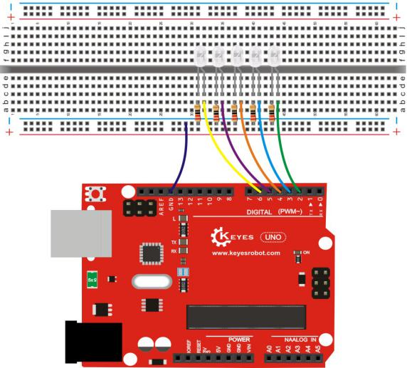

连接Keyes 2560 R3


测试代码

```
int BASE = 2 ;  //第一个 LED 接的 I/O 口
int NUM = 5;   //LED 的总数
void setup()
{
   for (int i = BASE; i < BASE + NUM; i ++) 
   {
     pinMode(i, OUTPUT);   //设定数字I/O口为输出
   }
}

void loop()
{
   for (int i = BASE; i < BASE + NUM; i ++) 
   {
     digitalWrite(i, HIGH);    //设定数字I/O口输出为"高"，即逐渐开灯
     delay(200);        //延迟
   }
   for (int i = BASE; i < BASE + NUM; i ++) 
   {
     digitalWrite(i, LOW);    //设定数字I/O口输出为"低"，即逐渐关灯
     delay(200);        //延迟
   }  
}
```


测试结果

下载完程序就可以看到我们的IO口外接小灯先逐渐变亮，然后逐渐变暗，循环交替。

## 实验四 按键控制LED实验

实验说明

I/O 口的意思即为INPUT 接口和OUTPUT
接口，到目前为止我们设计的小灯实验都还只是应用到Arduino 的I/O
口的输出功能，这个实验我们来尝试一下使用Arduino的I/O
口的输入功能即为读取外接设备的输出值，我们用一个按键和一个LED
小灯完成一个输入输出结合使用的实验，让大家能简单了解I/O 的作用。

实验器材

开发板 \*1

USB线\*1

LED\*1

轻触按键\*1

220Ω 电阻\*1

10KΩ 电阻\*1

面包板\*1

面包板连接线若干

接线图

连接Keyes UNO R3


连接Keyes 2560 R3


测试代码

```
int ledPin = 11;  //定义数字口11
int inputPin = 3; //定义数字口3
void setup() 
{
pinMode(ledPin, OUTPUT);   //将ledPin设置为输出 
pinMode(inputPin, INPUT); //将inputPin设置为输入 
}
void loop()
{
int val = digitalRead(inputPin);
//设置数字变量val，读取到数字口3的数值，并赋值给 val 
if (val == LOW) //当val为低电平时，LED变暗
{ 
digitalWrite(ledPin, LOW); // LED变暗
}
 else 
{
digitalWrite(ledPin, HIGH); // LED亮起
}
}
```


测试结果

下载完程序，上电后，当按键按下时小灯亮起，否则小灯不亮。

## 实验五 抢答器实验

实验说明

完成上面的实验以后相信已经有很多朋友可以独立完成这个实验了，我们可以将上面的按键控制小灯的实验扩展成4个按键对应3
个小灯，占用7个数字I/O 接口。为方便接线，我们把3个小灯用一个keyes
插件RGB模块代替。keyes 插件RGB模块代替由一个插件全彩LED制成，通过 R、
G、
B三个引脚的PWM电压输入可以调节三种基色（红/蓝/绿）的强度从而实现全彩的混色效果。

本实验中我们利用4个按键控制3个PWM口，控制RGB模块发光颜色从而达到抢答器的效果。

实验器材

开发板\*1

USB线\*1

keyes 插件RGB模块\*1

轻触按键\*4

10KΩ 电阻\*4

面包板\*1

面包板连接线若干

杜邦线若干

接线图

连接Keyes UNO R3

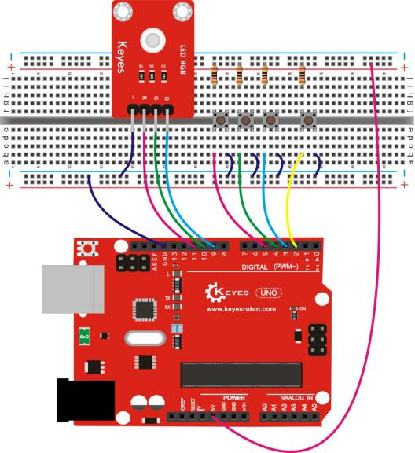

连接Keyes 2560 R3


测试代码

```
// 定义LED引脚（使用PWM输出）
int redled=11;     // 红色LED连接的数字引脚11
int greenled=10;   // 绿色LED连接的数字引脚10 
int blueled=9;     // 蓝色LED连接的数字引脚9  

// 定义按钮输入引脚
int redpin=5;      // 红色按钮连接的数字引脚5    
int greenpin=4;    // 绿色按钮连接的数字引脚4 
int bluepin=3;     // 蓝色按钮连接的数字引脚3   
int restpin=2;     // 复位按钮连接的数字引脚2   

// 存储按钮状态的变量
int red;           // 红色按钮状态
int green;         // 绿色按钮状态
int blue;          // 蓝色按钮状态

// 初始化函数
void setup()
{
  // 设置LED引脚为输出模式
  pinMode(redled,OUTPUT);
  pinMode(greenled,OUTPUT);
  pinMode(blueled,OUTPUT);
  
  // 设置按钮引脚为输入模式
  pinMode(redpin,INPUT);
  pinMode(greenpin,INPUT);
  pinMode(bluepin,INPUT);
}

// 主循环函数
void loop() 
{
  // 读取按钮状态
  red=digitalRead(redpin);
  green=digitalRead(greenpin);
  blue=digitalRead(bluepin);
  
  // 检测按钮按下并执行对应函数
  if(red==LOW)RED_YES();    // 如果红色按钮按下，执行RED_YES()
  if(green==LOW)GREEN_YES();// 如果绿色按钮按下，执行GREEN_YES()
  if(blue==LOW)BLUE_YES();  // 如果蓝色按钮按下，执行BLUE_YES()
}

// 红色LED控制函数
void RED_YES() 
{
  // 当复位按钮未被按下时保持红色
  while(digitalRead(restpin)==1)
  {
    color(255, 0, 0); // 设置RGB颜色为纯红
  }
  clear_led(); // 复位后清除LED颜色
}

// 绿色LED控制函数
void GREEN_YES()
{
  // 当复位按钮未被按下时保持绿色
  while(digitalRead(restpin)==1)
  {
    color(0, 255, 0); // 设置RGB颜色为纯绿
  }
  clear_led(); // 复位后清除LED颜色
}

// 蓝色LED控制函数
void BLUE_YES()
{
  // 当复位按钮未被按下时保持蓝色
  while(digitalRead(restpin)==1)
  {
    color(0, 0, 255); // 设置RGB颜色为纯蓝
  }
  clear_led(); // 复位后清除LED颜色
}

// 关闭所有LED函数
void clear_led()
{
  color(0, 0, 0); // 设置RGB颜色为全关(黑色)
}

// RGB颜色控制函数
void color (unsigned char red, unsigned char green, unsigned char blue)  
{    
  analogWrite(redled, red);   // 设置红色LED亮度
  analogWrite(greenled,green); // 设置绿色LED亮度
  analogWrite(blueled, blue); // 设置蓝色LED亮度
}
```

测试结果

下载完程序，上电后，一个简单的抢答器就做好了，我们根据RGB灯显示的颜色判断是谁抢答成功。在复位后。RGB灯关闭。

## 实验六 电位器调控灯光亮度实验

实验说明

在第二课程中我们直接通过PWM口控制灯的亮度，从而达到呼吸灯的效果。在这课程中我们通过一个电位器，利用电位器调节PWM值，从而控制灯的亮度。

实验器材

开发板\*1

USB线\*1

LED\*1

220Ω 电阻\*1

可调电位器\*1

面包板\*1

面包板连接线若干

接线图

连接Keyes UNO R3

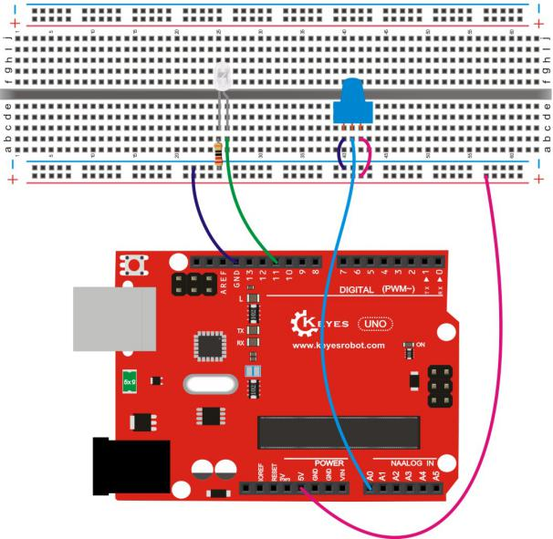

连接Keyes 2560 R3

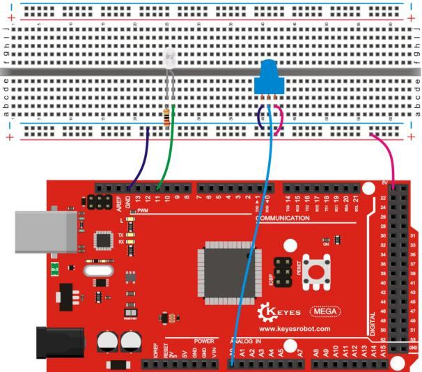

测试代码

```
int ledpin=11;//定义数字接口11（PWM 输出）
void setup()
{
pinMode(ledpin,OUTPUT);//定义数字接口11 为输出
Serial.begin(9600);//设置波特率为9600
}
void loop()
{
int val=analogRead(0);//读取模拟口A0口的值
val = map(val, 0, 1023, 0, 255);//从0-1023映射到0-255
Serial.println(val);//显示val 变量
analogWrite(ledpin,val);// 打开LED 并设置亮度
delay(100);//延时0.1 秒
}
```

测试结果

下载完程序后。我们可以通过旋转可调电位器控制小灯的亮度，打开串口监视器，设置波特率为9600，就可看到调节LED亮度的PWM值。

## 实验七 感光灯实验

实验说明

完成以上的各种实验后，我们对Arduino
的应用也应该有一些认识和了解了，在基本的数字量输入输出和模拟量输入以及PWM
的产生都掌握以后，我们就可以开始进行一些传感器的应用了。

本次实验我们先进行一个较为简单的光敏电阻的使用实验。光敏电阻既然是可以根据光强改变阻值的元件，自然也需要模拟口读取模拟值了，本实验可以借鉴电位器调控灯光亮度实验，将电位计换做光敏电阻实现当光强不同时LED
小灯的亮度也会有相应的变化。

实验器材

开发板\*1

USB线\*1

LED\*1

220Ω 电阻\*1

10KΩ 电阻\*1

光敏电阻\*1

面包板\*1

面包板连接线若干

接线图

连接Keyes UNO R3


连接Keyes 2560 R3


测试代码

```
int ledpin=11;//定义数字接口11（PWM 输出）
void setup()
{
pinMode(ledpin,OUTPUT);//定义数字接口11 为输出
Serial.begin(9600);//设置波特率为9600
}
void loop()
{
int val=analogRead(0);//读取模拟口A0口的值
Serial.println(val);//显示val 变量
val = map(val, 0, 1023, 0, 255);//从0-1023映射到0-255
analogWrite(ledpin,val);// 打开LED 并设置亮度
delay(10);//延时0.01 秒
}
```


测试结果

下载完程序后，光敏电阻感应到灯光越亮，小灯越暗；光敏电阻感应到灯光越暗，小灯越亮。打开串口监视器，设置波特率为9600，就可看到光敏电阻感应到外界光强所得的模拟值。

## 实验八 有源蜂鸣器实验

实验说明

蜂鸣器可分为有源蜂鸣器和无源蜂鸣器两种。本课程中主要用到了有源蜂鸣器，有源蜂鸣器内部有一简单的振荡电路，能将恒定的直流电转化成一定频率的脉冲信号。实验中中我们只需要给蜂鸣器输入一个高电平信号，蜂鸣器响起。

实验器材

开发板\*1

USB线\*1

有源蜂鸣器\*1

面包板\*1

面包板连接线若干

接线图

连接Keyes UNO R3

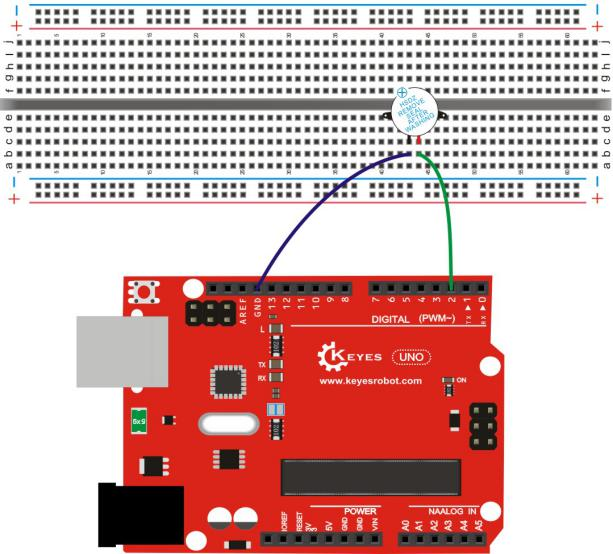

连接Keyes 2560 R3

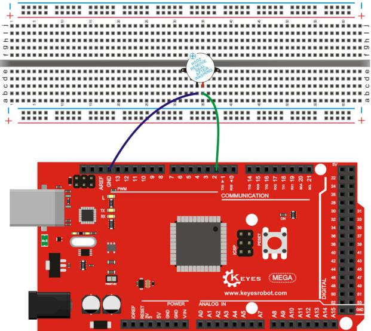

测试代码

```
int buzzer = 2;                     //定义数字口2
void setup()
{
  pinMode(buzzer, OUTPUT);     //设置buzzer为输出
}
void loop()
{
  digitalWrite(buzzer, HIGH);   //开启buzzer
  delay(1000); //延迟1S               
  digitalWrite(buzzer, LOW);    //关闭buzzer
  delay(1000);//延迟1S
}
```


测试结果

下载完程序后，我们可以听到蜂鸣器响1秒，停止响起1秒，循环交替。

## 实验九 无源蜂鸣器实验

实验说明

蜂鸣器可分为有源蜂鸣器和无源蜂鸣器两种。本课程中主要用到了无源蜂鸣器，无源蜂鸣器内部不带振荡源，直流信号无法令其鸣叫，须用方波驱动。

实验器材

开发板 \*1

USB线\*1

无源蜂鸣器\*1

面包板\*1

面包板连接线若干

接线图

连接Keyes UNO R3

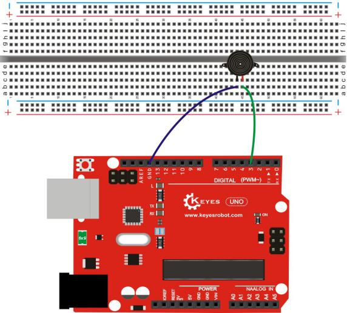

连接Keyes 2560 R3


测试代码

code 1:

```
int buzzer=3;          //定义数字口3
void setup() 
{ 
pinMode(buzzer,OUTPUT);//将buzzer设置为输出
} 
void loop() 
{ 
unsigned char i,j;//定义变量i，j
while(1) 
{ 
for(i=0;i<80;i++)// 输出一个频率的声音
{ 
digitalWrite(buzzer,HIGH);
delay(1);//延迟1ms 
digitalWrite(buzzer,LOW);
delay(1);//延迟1ms 
} 
for(i=0;i<100;i++)//  输出另一个频率的声音
{ 
digitalWrite(buzzer,HIGH); 
delay(2);//延迟2ms 
digitalWrite(buzzer,LOW); 
delay(2);//延迟2ms 
}
} 
} 
```


code 2:

```
#define D0 -1
#define D1 262
#define D2 293
#define D3 329
#define D4 349
#define D5 392
#define D6 440
#define D7 494
#define M1 523
#define M2 586
#define M3 658
#define M4 697
#define M5 783
#define M6 879
#define M7 987
#define H1 1045
#define H2 1171
#define H3 1316
#define H4 1393
#define H5 1563
#define H6 1755
#define H7 1971
//列出全部D调的频率
#define WHOLE 1
#define HALF 0.5
#define QUARTER 0.25
#define EIGHTH 0.25
#define SIXTEENTH 0.625
//列出所有节拍
int tune[]=        //根据简谱列出各频率
{
  M3,M3,M4,M5,
  M5,M4,M3,M2,
  M1,M1,M2,M3,
  M3,M2,M2,
  M3,M3,M4,M5,
  M5,M4,M3,M2,
  M1,M1,M2,M3,
  M2,M1,M1,
  M2,M2,M3,M1,
  M2,M3,M4,M3,M1,
  M2,M3,M4,M3,M2,
  M1,M2,D5,D0,
  M3,M3,M4,M5,
  M5,M4,M3,M4,M2,
  M1,M1,M2,M3,
  M2,M1,M1
};
float durt[]=       //根据简谱列出各节拍
{
  1,1,1,1,
  1,1,1,1,
  1,1,1,1,
  1+0.5,0.5,1+1,
  1,1,1,1,
  1,1,1,1,
  1,1,1,1,
  1+0.5,0.5,1+1,
  1,1,1,1,
  1,0.5,0.5,1,1,
  1,0.5,0.5,1,1,
  1,1,1,1,
  1,1,1,1,
  1,1,1,0.5,0.5,
  1,1,1,1,
  1+0.5,0.5,1+1,
};
int length;
int tonepin=3;   //得用3号接口
void setup()
{
  pinMode(tonepin,OUTPUT);
  length=sizeof(tune)/sizeof(tune[0]);   //计算长度
}
void loop()
{
  for(int x=0;x<length;x++)
  {
    tone(tonepin,tune[x]);
    delay(500*durt[x]);   //这里用来根据节拍调节延时，500这个指数可以自己调整，在该音乐中，我发现用500比较合适。
    noTone(tonepin);
  }
  delay(2000);
}
```


测试结果

实验中我们提供了两个例程，上传例程1代码后，蜂鸣器会发出两种不同的声音，实验中，两种声音循环交替。上传例程2中代码后，蜂鸣器会想响起《欢乐颂》的曲子。

## 实验十 火焰报警实验

实验说明

火焰传感器是机器人专门用来搜寻火源的传感器，本传感器对火焰特别灵敏。火焰传感器利用红外线对火焰非常敏感的特点，使用特制的红外线接收管来检测火焰，然后把火焰的亮度转化为高低变化的电平信号。

实验中，我们把火焰的亮度转化为高低变化的电平信号输入到UNO板中，然后控制蜂鸣器的响起。

实验器材

开发板\*1

USB线\*1

有源蜂鸣器\*1

火焰传感器\*1

10KΩ 电阻\*1

面包板\*1

面包板连接线若干

接线图

连接Keyes UNO R3

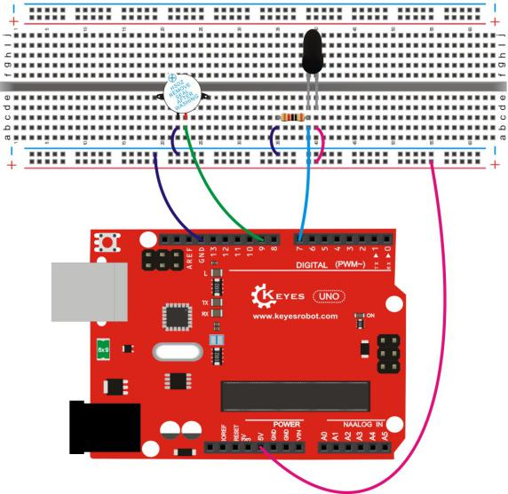

连接Keyes 2560 R3


测试代码

```
int flame=7;//定义火焰接口为数字7 接口
int Beep=9;//定义蜂鸣器接口为数字9 接口
void setup() 
{
 pinMode(Beep,OUTPUT);//定义Beep为输出接口
 pinMode(flame,INPUT);//定义flame为输入接口
 } 
void loop() 
{ 
  int val=digitalRead(flame);//读取火焰传感器 
  if(val==HIGH)//当数字口7为高电平时蜂鸣器鸣响
  {  
   digitalWrite(Beep,HIGH); 
   }else 
   {  
     digitalWrite(Beep,LOW); 
    }
   delay(500); 
}

```

测试结果

下载完程序后，我们可以模拟在有火焰时报警的情况，在没有火焰时一切正常，当有火焰时立刻报警做出提示。

## 实验十一 温馨水杯实验

实验说明

LM35 是很常用且易用的温度传感器元件，将LM35
温度传感器接到开发板上，通过算法可将读取的模拟值转换为实际的温度。

本实验中我们还外接了3个指示灯，在代码中我没设置在不同的温度范围，亮起不同颜色的指示灯。根据这个，我们完全可以做个温馨水杯，通过指示灯，我们就可以知道杯子里的水的冷热情况。

实验器材

开发板 \*1

USB线\*1

LM35DZ\*1

LED\*3

220Ω 电阻\*3

面包板\*1

面包板连接线若干

接线图

连接Keyes UNO R3


连接Keyes 2560 R3


测试代码

```
// 初始化函数
void setup() {
  // 初始化串口通信，波特率设置为9600
  Serial.begin(9600);
  
  // 设置数字引脚12、11、10为输出模式（用于控制LED等设备）
  pinMode(12, OUTPUT);
  pinMode(11, OUTPUT);
  pinMode(10, OUTPUT);
}

// 主循环函数
void loop() {
  // 读取模拟输入A0的值，并转换为温度值（假设是温度传感器）
  // 计算过程：模拟值(0-1023) -> 电压值(0-5V) -> 温度值(0-100℃)
  int vol = analogRead(A0) * (5.0 / 1023.0 * 100);  
  
  // 通过串口打印温度值
  Serial.print("Tep:");      // 输出温度标签
  Serial.print(vol);         // 输出温度数值
  Serial.println("C");       // 输出温度单位并换行

  // 温度控制逻辑
  if (vol < 28) {                   // 当温度低于28℃时
    digitalWrite(12, HIGH);        // 开启12号引脚设备（如红色LED）
    digitalWrite(11, LOW);          // 关闭11号引脚设备
    digitalWrite(10, LOW);          // 关闭10号引脚设备
  }
  else if (vol >= 28 && vol <= 30) { // 当温度在28℃到30℃之间时                            
    digitalWrite(12, LOW);          // 关闭12号引脚设备
    digitalWrite(11, HIGH);         // 开启11号引脚设备（如黄色LED）
    digitalWrite(10, LOW);          // 关闭10号引脚设备
  }
  else if (vol > 30) {              // 当温度高于30℃时                              
    digitalWrite(12, LOW);          // 关闭12号引脚设备
    digitalWrite(11, LOW);          // 关闭11号引脚设备
    digitalWrite(10, HIGH);         // 开启10号引脚设备（如绿色LED）
  }
}
```

测试结果

下载完程序后，打开串口监视器，设置波特率为9600，就可看到当前的温度。当温度大于30摄氏度时，红色指示灯亮起，其他指示灯熄灭；当温度大于等于28摄氏度且小于等于30摄氏度时，红色指示灯熄灭，黄色指示灯亮起；当温度小于28摄氏度时，黄色指示灯熄灭，蓝色指示灯亮起。

## 实验十二 魔术光杯实验

实验说明

倾斜开关的工作原理是当开关一端低于水平位置倾斜，开关寻通；当另一端低于水平位置倾斜
，开关停止。魔术光杯实验原理是利用 PWM
调光的原理，两个LED的亮度发生变化。

这个实验中倾斜开关提供数字信号，触发 PWM
的调节，通过程序的设计，我们就能看到类似于两组装满光的杯子倒来倒去的效果了。

实验器材

开发板\*1

USB线\*1

LED\*2

倾斜开关\*2

220Ω 电阻\*2

10KΩ 电阻\*2

面包板\*1

面包板连接线若干

接线图

连接Keyes UNO R3

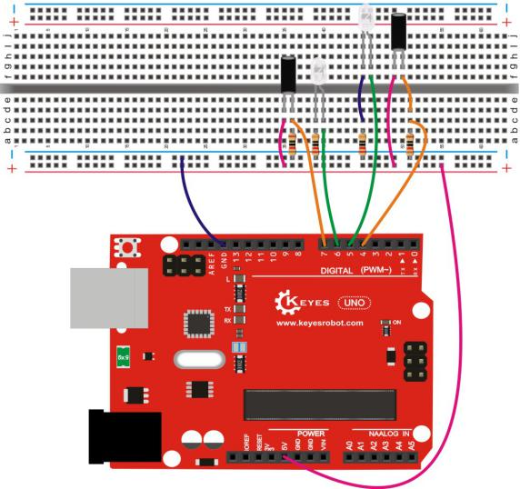

连接Keyes 2560 R3


测试代码

```
int LedPinA = 5; //定义数字口5
int LedPinB = 6; //定义数字口6
int ButtonPinA = 7;//定义数字口7
int ButtonPinB = 4;//定义数字口4
int buttonStateA = 0;
int buttonStateB = 0;
int brightnessA = 0;
int brightnessB= 255;
void setup()
{
Serial.begin(9600);//设置波特率
pinMode(LedPinA, OUTPUT);//数字口5设置为输出
pinMode(LedPinB, OUTPUT);//数字口6设置为输出
pinMode(ButtonPinA, INPUT);//数字口7设置为输入
pinMode(ButtonPinB, INPUT);//数字口4设置为输入
}
void loop()
{
buttonStateA = digitalRead(ButtonPinA);//读取数字口7的数值赋值给buttonStateA
if (buttonStateA == HIGH && brightnessA != 255)
//当buttonStateA为高电平且brightnessA不为255
{
brightnessA ++;//brightnessA加1
delay(10);//延迟0.01S
}
if (buttonStateA == LOW && brightnessA != 0)
//当buttonStateA为低电平且brightnessA不为0
{
brightnessA --;//brightnessA减1
delay(10);//延迟0.01S
}
analogWrite(LedPinB, brightnessA);//将brightnessA赋值为给PWM口6
Serial.print(brightnessA);//显示brightnessA数值
Serial.print("   ");
buttonStateB = digitalRead(ButtonPinB);//读取数字口4的数值赋值给buttonStateB
if (buttonStateB == HIGH && brightnessB != 0)
//当buttonStateB为高电平且brightnessA不为0
{
brightnessB --;//brightnessB减1
delay(10);//延迟0.01S
}
if (buttonStateB == LOW && brightnessB != 255)
//当buttonStateB为低电平且brightnessA不为255
{
brightnessB++;//brightnessB加1
delay(10);//延迟0.01S
}
analogWrite(LedPinA, brightnessB); //将brightnessB赋值为给PWM口5
Serial.println(brightnessB);//显示brightnessB数值，并自动换行
delay(5);
}

```


测试结果

按照上图接好线，烧录好代码，上电后，将两个倾斜开关同时倾斜一边，
一个LED逐渐变暗，同时另一个逐渐变亮，最终一个LED完全熄灭，一个LED最亮；在串口监视器中看到对应具体数值变化，如下图。当倾斜另一边中，现象一样，方向相反。

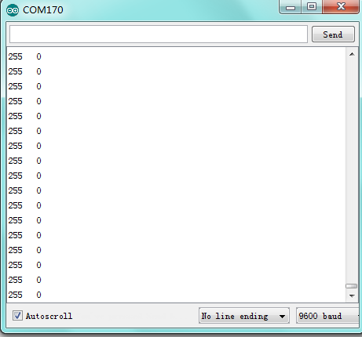

## 实验十三 红外遥控解码实验

实验说明

通用红外遥控系统由发射和接收两大部分组成。本实验中发射部分就是遥控器，接收部分就是红外接收
VS1838B。红外接收
VS1838B是集接收、放大、解调一体的器件，它内部IC就已经完成了解调，输出的就是数字信号。

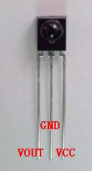

实验器材

开发板\*1

USB线\*1

红外遥控\*1

红外接收 VS1838B\*1

面包板\*1

面包板连接线若干

接线图

连接Keyes UNO R3

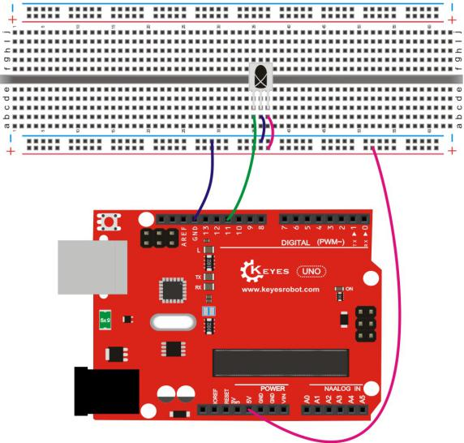

连接Keyes 2560 R3

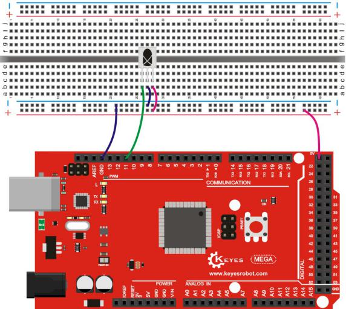

测试代码

```
#include <IRremote.h>
int RECV_PIN = 11; //定义数字口11
IRrecv irrecv(RECV_PIN);
decode_results results;
void setup()
{
Serial.begin(9600);//设置波特率
irrecv.enableIRIn(); // 使能红外接收
}
void loop() {
if (irrecv.decode(&results)) 
{
Serial.println(results.value, HEX);//显示数据
irrecv.resume(); // 接收下个数据
}
}
```

测试结果

下载完程序，上电后，红外遥控对准红外接收传感器发送信号，我们可以在串口监视器总看到相应按键的编码，如下图。

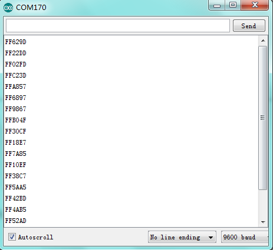


## 实验十四 一位数码管显示实验

实验说明

数码管是一种半导体发光器件，其基本单元是发光二极管。数码管按段数分为七段数码管和八段数码管，八段数码管比七段数码管多一个发光二极管单元（多一个小数点显示），本实验所使用的是八段数码管。数码管共有七段显示数字的段，还有一个显示小数点的段。当让数码管显示数字时，只要将相应的段点亮即可。

实验器材

开发板 \*1

USB线\*1

一位数码管\*1

220Ω 电阻\*8

面包板\*1

面包板连接线若干

接线图

连接Keyes UNO R3

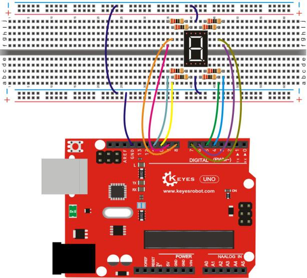

连接Keyes 2560 R3

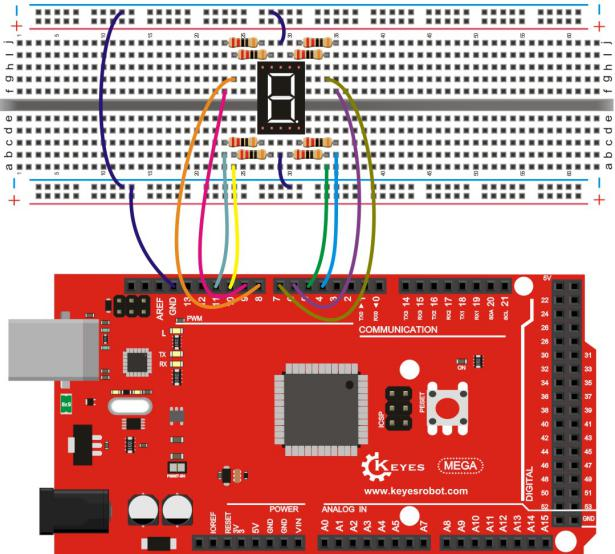

测试代码

```
//设置控制各段的数字IO 脚
int a=7;//定义数字接口7 连接a 段数码管
int b=6;// 定义数字接口6 连接b 段数码管
int c=5;// 定义数字接口5 连接c 段数码管
int d=10;// 定义数字接口11 连接d 段数码管
int e=11;// 定义数字接口10 连接e 段数码管
int f=8;// 定义数字接口8 连接f 段数码管
int g=9;// 定义数字接口9 连接g 段数码管
int dp=4;// 定义数字接口4 连接dp 段数码管
void digital_1(void) //显示数字1
{
unsigned char j;
digitalWrite(c,HIGH);//给数字接口5 引脚高电平，点亮c 段
digitalWrite(b,HIGH);//点亮b 段
for(j=7;j<=11;j++)//熄灭其余段
digitalWrite(j,LOW);
digitalWrite(dp,LOW);//熄灭小数点DP 段
}
void digital_2(void) //显示数字2
{
unsigned char j;
digitalWrite(b,HIGH);
digitalWrite(a,HIGH);
for(j=9;j<=11;j++)
digitalWrite(j,HIGH);
digitalWrite(dp,LOW);
digitalWrite(c,LOW);
digitalWrite(f,LOW);
}
void digital_3(void) //显示数字3
{
unsigned char j;
digitalWrite(g,HIGH);
digitalWrite(d,HIGH);
for(j=5;j<=7;j++)
digitalWrite(j,HIGH);
digitalWrite(dp,LOW);
digitalWrite(f,LOW);
digitalWrite(e,LOW);
}
void digital_4(void) //显示数字4
{
digitalWrite(c,HIGH);
digitalWrite(b,HIGH);
digitalWrite(f,HIGH);
digitalWrite(g,HIGH);
digitalWrite(dp,LOW);
digitalWrite(a,LOW);
digitalWrite(e,LOW);
digitalWrite(d,LOW);
}
void digital_5(void) //显示数字5
{
unsigned char j;
for(j=7;j<=9;j++)
digitalWrite(j,HIGH);
digitalWrite(c,HIGH);
digitalWrite(d,HIGH);
digitalWrite(dp,LOW);
digitalWrite(b,LOW);
digitalWrite(e,LOW);
}
void digital_6(void) //显示数字6
{
unsigned char j;
for(j=7;j<=11;j++)
digitalWrite(j,HIGH);
digitalWrite(c,HIGH);
digitalWrite(dp,LOW);
digitalWrite(b,LOW);
}
void digital_7(void) //显示数字7
{
unsigned char j;
for(j=5;j<=7;j++)
digitalWrite(j,HIGH);
digitalWrite(dp,LOW);
for(j=8;j<=11;j++)
digitalWrite(j,LOW);
}
void digital_8(void) //显示数字8
{
unsigned char j;
for(j=5;j<=11;j++)
digitalWrite(j,HIGH);
digitalWrite(dp,LOW);
}
void setup()
{
int i;//定义变量
for(i=4;i<=11;i++)
pinMode(i,OUTPUT);//设置4～11 引脚为输出模式
}
void loop()
{
while(1)
{
digital_1();//显示数字1
delay(2000);//延时2s
digital_2();//显示数字2
delay(1000); //延时1s
digital_3();//显示数字3
delay(1000); //延时1s
digital_4();//显示数字4
delay(1000); //延时1s
digital_5();//显示数字5
delay(1000); //延时1s
digital_6();//显示数字6
delay(1000); //延时1s
digital_7();//显示数字7
delay(1000); //延时1s
digital_8();//显示数字8
delay(1000); //延时1s
}
}
```


测试结果

下载完程序后，数码管循环显示1～8 数字。

## 实验十五 74HC595驱动一位数码管实验

实验说明

上一个实验中我们直接把用开发板控制一位数码管，需要占用了较多的数字口，本实验中我们添加了一个74HC595芯片控制一位数码管，只需要用3个数字口就可以控制8个LED灯，具体设置方法可以参照以下表格。

|  | Q7 | Q6 | Q5 | Q4 | Q3 | Q2 | Q1 | Q0 |  |
|-|-|-|-|-|-|-|-|-|-|
|  | a | b | c | d | e | f | g | dp |  |
| 0 | 1 | 1 | 1 | 1 | 1 | 1 | 0 | 0 | 252 |
| 1 | 0 | 1 | 1 | 0 | 0 | 0 | 0 | 0 | 96 |
| 2 | 1 | 1 | 0 | 1 | 1 | 0 | 1 | 0 | 218 |
| 3 | 1 | 1 | 1 | 1 | 0 | 0 | 1 | 0 | 242 |
| 4 | 0 | 1 | 1 | 0 | 0 | 1 | 1 | 0 | 102 |
| 5 | 1 | 0 | 1 | 1 | 0 | 1 | 1 | 0 | 182 |
| 6 | 1 | 0 | 1 | 1 | 1 | 1 | 1 | 0 | 190 |
| 7 | 1 | 1 | 1 | 0 | 0 | 0 | 0 | 0 | 224 |
| 8 | 1 | 1 | 1 | 1 | 1 | 1 | 1 | 0 | 254 |
| 9 | 1 | 1 | 1 | 1 | 0 | 1 | 1 | 0 | 246 |

实验器材

开发板\*1

USB线\*1

74HC595\*1

一位数码管\*1

220Ω 电阻\*8

面包板\*1

面包板连接线若干

接线图

连接Keyes UNO R3

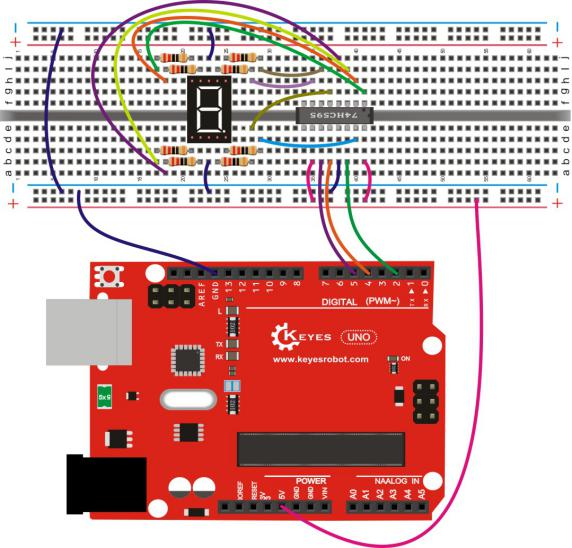

连接Keyes 2560 R3

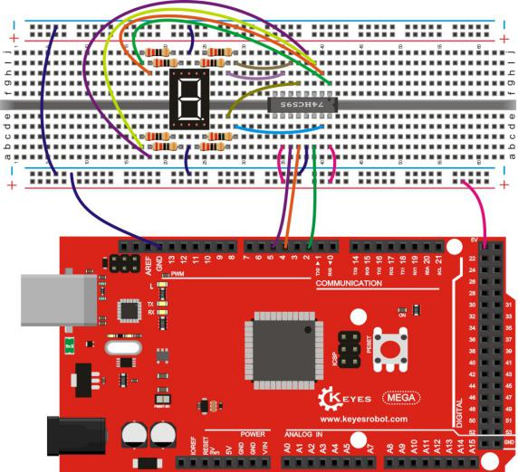

测试代码

```
int latchPin = 4;
int clockPin = 5;
int dataPin = 2; //这里定义了那三个脚
void setup ()
{
  pinMode(latchPin,OUTPUT);
  pinMode(clockPin,OUTPUT);
  pinMode(dataPin,OUTPUT); //让三个脚都是输出状态
}
void loop()
{

  int a[10]={
    246,254,224,190,182,102,242,218,96,252};   //定义功能数组，数组依次为数码管得定义
  for(int x=9; x>-1 ;x-- )                        //倒数功能循环
  {
    digitalWrite(latchPin,LOW);
    shiftOut(dataPin,clockPin,MSBFIRST,a[x]);     //显示数组a[x]
    digitalWrite(latchPin,HIGH);
    delay(1000);
  }
}
```

测试结果

下载完程序后，数码管循环显示0～9 数字。

## 实验十六 8\*8点阵显示实验

实验说明

点阵在我们生活中很常见，很多都有用到他，比如LED广告显示屏，电梯显示楼层，公交车报站等等。

8\*8点阵共由64个发光二极管组成，且每个发光二极管是放置在行线和列线的交叉点上，当对应的某一行置高电平，某一列置低电平，则相应的二极管就亮；如要将第一个点点亮，则7脚接高电平A脚接低电平，则第一个点就亮了；如果要将第一行点亮，则第7脚要接高电平，而A、B、C、D、E、F、G、H这些引脚接低电平，那么第一行就会点亮；如要将第一列点亮，则第A脚接低电平，而0、1、2、3、4、5、6、7接高电平，那么第一列就会点亮。

在本课程中，我们只是让点阵输出一个“0”。

8\*8点阵原理图


8\*8点阵实物图

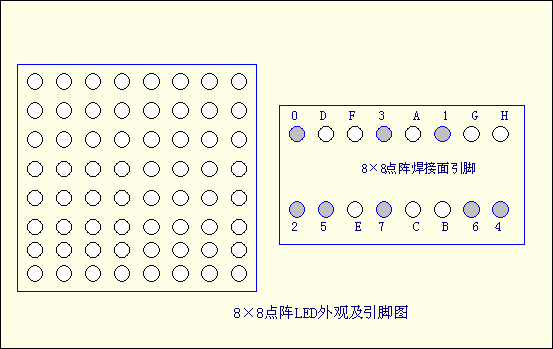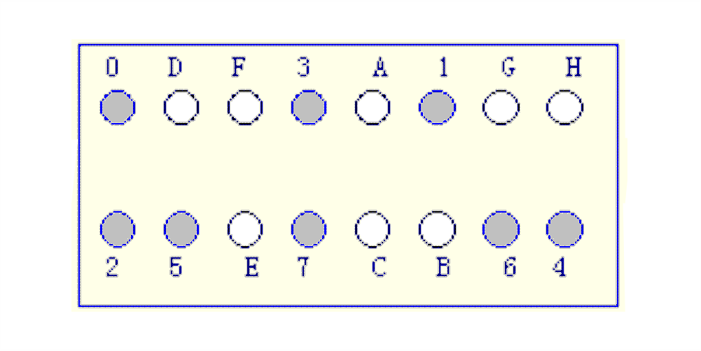

实验器材

开发板\*1

USB线\*1

8\*8点阵\*1

220Ω 电阻\*8

面包板\*1

面包板连接线若干

接线图

连接Keyes UNO R3

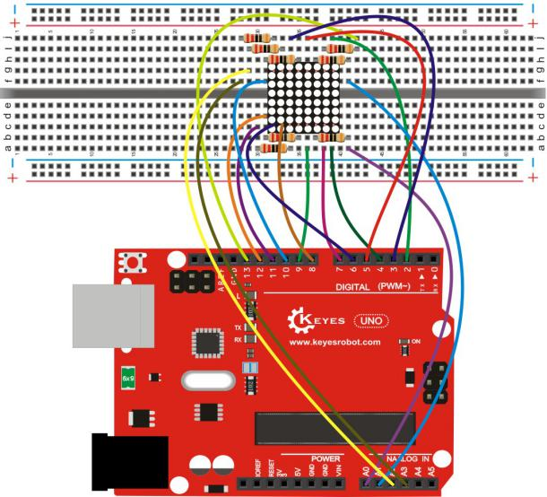

连接Keyes 2560 R3

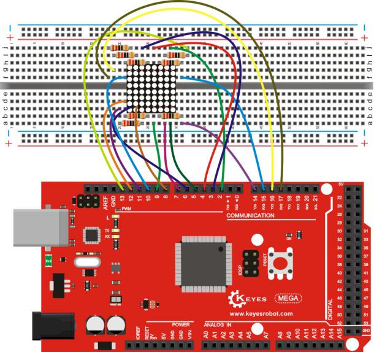

测试代码

```
//定义了一个数组，用来存放“0”字的字模
unsigned char Text[]={0x00,0x1c,0x22,0x22,0x22,0x22,0x22,0x1c};
void Draw_point(unsigned char x,unsigned char y)//画点函数
{
   clear_();
   digitalWrite(x+2, HIGH);
   digitalWrite(y+10, LOW);
   delay(1);
}
void show_num(void)//显示函数，最终还是调用了画点函数。
{
  unsigned char i,j,data;
  for(i=0;i<8;i++)
  {
    data=Text[i];
    for(j=0;j<8;j++)
    {
      if(data & 0x01)Draw_point(j,i);
      data>>=1;
    }  
  }
}
void setup(){ 
int i = 0 ; 
for(i=2;i<18;i++) 
 { 
   pinMode(i, OUTPUT); 
  }  
  clear_(); 
}
void loop()
{ 
  show_num();    
} 
void clear_(void)//清除屏幕
{
  for(int i=2;i<10;i++)
  digitalWrite(i, LOW);
  for(int i=0;i<8;i++)
  digitalWrite(i+10, HIGH);
}
```

测试结果

下载完程序后，点阵上显示数字“0”。

## 实验十七 四位数码管显示数字实验

实验说明

在实验十五中我们使用开发板驱动一个一位数码管，本实验我们使用开发板驱动一个共阴四位数码管。驱动数码管限流电阻肯定是必不可少的，限流电阻有两种接法，一种是在d1-d4阴极接，总共接4颗。这种接法好处是需求电阻比较少，但是会产生每一位上显示不同数字亮度会不一样，1最亮，8最暗。另外一种接法就是在其他8个引脚上接，这种接法亮度显示均匀，但是用电阻较多。本次实验使用8颗220Ω电阻。

四位数码管总共有12个引脚，小数点朝下正放在面前时，左下角为1,其他管脚顺序为逆时针旋转。左上角为最大的12号管脚。


四位数码管原理图如下


实验器材

开发板\*1

USB线\*1

四位数码管\*1

220Ω 电阻\*8

面包板\*1

面包板连接线若干

接线图

连接Keyes UNO R3


连接Keyes 2560 R3

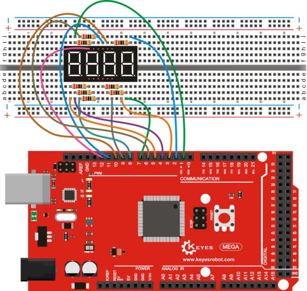

测试代码

```
// 数码管各段引脚定义
int a = 1;  // a段数码管引脚
int b = 2;  // b段数码管引脚
int c = 3;  // c段数码管引脚
int d = 4;  // d段数码管引脚
int e = 5;  // e段数码管引脚
int f = 6;  // f段数码管引脚
int g = 7;  // g段数码管引脚
int dp = 8; // dp小数点引脚

// 数码管位选引脚定义
int d4 = 9;  // 第4位数码管位选
int d3 = 10; // 第3位数码管位选
int d2 = 11; // 第2位数码管位选
int d1 = 12; // 第1位数码管位选

// 全局变量
long n = 1230;  // 初始数值
int x = 100;    // 未使用变量
int del = 55;   // 延时调整参数

// 初始化设置
void setup()
{
  // 设置所有引脚为输出模式
  pinMode(d1, OUTPUT);
  pinMode(d2, OUTPUT);
  pinMode(d3, OUTPUT);
  pinMode(d4, OUTPUT);
  pinMode(a, OUTPUT);
  pinMode(b, OUTPUT);
  pinMode(c, OUTPUT);
  pinMode(d, OUTPUT);
  pinMode(e, OUTPUT);
  pinMode(f, OUTPUT);
  pinMode(g, OUTPUT);
  pinMode(dp, OUTPUT);
}

// 主循环
void loop()
{
  int a=0; // 千位计数器
  int b=0; // 百位计数器
  int c=0; // 十位计数器
  int d=0; // 个位计数器
  
  // 获取当前时间
  unsigned long currentMillis = millis();

  // 无限计数循环
  while(d>=0)
  {
    // 每秒更新一次显示
    while(millis()-currentMillis<1000)
    {
      // 动态扫描显示4位数码管
      Display(1,a);
      Display(2,b);
      Display(3,c);
      Display(4,d);
    }
    
    // 更新时间标记
    currentMillis = millis(); 
    
    // 数字递增
    d++;  
    
    // 进位处理
    if (d>9) 
    {
      c++;
      d=0;
    }
    if (c>9) 
    {
      b++;
      c=0;
    }
    if (b>9) 
    {
      a++;
      b=0;
    }
    if (a>9) 
    {
      a=0;
      b=0;
      c=0;
      d=0;
    }
  }  
}

// 位选函数
void WeiXuan(unsigned char n)
{
  switch (n)
  {
    case 1:
      digitalWrite(d1, LOW);
      digitalWrite(d2, HIGH);
      digitalWrite(d3, HIGH);
      digitalWrite(d4, HIGH);
      break;
    case 2:
      digitalWrite(d1, HIGH);
      digitalWrite(d2, LOW);
      digitalWrite(d3, HIGH);
      digitalWrite(d4, HIGH);
      break;
    case 3:
      digitalWrite(d1, HIGH);
      digitalWrite(d2, HIGH);
      digitalWrite(d3, LOW);
      digitalWrite(d4, HIGH);
      break;
    case 4:
      digitalWrite(d1, HIGH);
      digitalWrite(d2, HIGH);
      digitalWrite(d3, HIGH);
      digitalWrite(d4, LOW);
      break;
    default :
      digitalWrite(d1, HIGH);
      digitalWrite(d2, HIGH);
      digitalWrite(d3, HIGH);
      digitalWrite(d4, HIGH);
      break;
  }
}

// 数字0-9的段选定义
void Num_0()
{
  digitalWrite(a, HIGH);
  digitalWrite(b, HIGH);
  digitalWrite(c, HIGH);
  digitalWrite(d, HIGH);
  digitalWrite(e, HIGH);
  digitalWrite(f, HIGH);
  digitalWrite(g, LOW);
  digitalWrite(dp, LOW);
}
void Num_1()
{
  digitalWrite(a, LOW);
  digitalWrite(b, HIGH);
  digitalWrite(c, HIGH);
  digitalWrite(d, LOW);
  digitalWrite(e, LOW);
  digitalWrite(f, LOW);
  digitalWrite(g, LOW);
  digitalWrite(dp, LOW);
}
void Num_2()
{
  digitalWrite(a, HIGH);
  digitalWrite(b, HIGH);
  digitalWrite(c, LOW);
  digitalWrite(d, HIGH);
  digitalWrite(e, HIGH);
  digitalWrite(f, LOW);
  digitalWrite(g, HIGH);
  digitalWrite(dp, LOW);
}
void Num_3()
{
  digitalWrite(a, HIGH);
  digitalWrite(b, HIGH);
  digitalWrite(c, HIGH);
  digitalWrite(d, HIGH);
  digitalWrite(e, LOW);
  digitalWrite(f, LOW);
  digitalWrite(g, HIGH);
  digitalWrite(dp, LOW);
}
void Num_4()
{
  digitalWrite(a, LOW);
  digitalWrite(b, HIGH);
  digitalWrite(c, HIGH);
  digitalWrite(d, LOW);
  digitalWrite(e, LOW);
  digitalWrite(f, HIGH);
  digitalWrite(g, HIGH);
  digitalWrite(dp, LOW);
}
void Num_5()
{
  digitalWrite(a, HIGH);
  digitalWrite(b, LOW);
  digitalWrite(c, HIGH);
  digitalWrite(d, HIGH);
  digitalWrite(e, LOW);
  digitalWrite(f, HIGH);
  digitalWrite(g, HIGH);
  digitalWrite(dp, LOW);
}
void Num_6()
{
  digitalWrite(a, HIGH);
  digitalWrite(b, LOW);
  digitalWrite(c, HIGH);
  digitalWrite(d, HIGH);
  digitalWrite(e, HIGH);
  digitalWrite(f, HIGH);
  digitalWrite(g, HIGH);
  digitalWrite(dp, LOW);
}
void Num_7()
{
  digitalWrite(a, HIGH);
  digitalWrite(b, HIGH);
  digitalWrite(c, HIGH);
  digitalWrite(d, LOW);
  digitalWrite(e, LOW);
  digitalWrite(f, LOW);
  digitalWrite(g, LOW);
  digitalWrite(dp, LOW);
}
void Num_8()
{
  digitalWrite(a, HIGH);
  digitalWrite(b, HIGH);
  digitalWrite(c, HIGH);
  digitalWrite(d, HIGH);
  digitalWrite(e, HIGH);
  digitalWrite(f, HIGH);
  digitalWrite(g, HIGH);
  digitalWrite(dp, LOW);
}
void Num_9()
{
  digitalWrite(a, HIGH);
  digitalWrite(b, HIGH);
  digitalWrite(c, HIGH);
  digitalWrite(d, HIGH);
  digitalWrite(e, LOW);
  digitalWrite(f, HIGH);
  digitalWrite(g, HIGH);
  digitalWrite(dp, LOW);
}

// 清空数码管显示
void Clear()
{
  digitalWrite(a, LOW);
  digitalWrite(b, LOW);
  digitalWrite(c, LOW);
  digitalWrite(d, LOW);
  digitalWrite(e, LOW);
  digitalWrite(f, LOW);
  digitalWrite(g, LOW);
  digitalWrite(dp, LOW);
}

// 数字选择函数
void pickNumber(unsigned char n)
{
  switch (n)
  {
    case 0: Num_0();
      break;
    case 1: Num_1();
      break;
    case 2: Num_2();
      break;
    case 3: Num_3();
      break;
    case 4: Num_4();
      break;
    case 5: Num_5();
      break;
    case 6: Num_6();
      break;
    case 7: Num_7();
      break;
    case 8: Num_8();
      break;
    case 9: Num_9();
      break;
    default: Clear();
      break;
  }
}

// 数码管显示函数
void Display(unsigned char x, unsigned char Number)
{
  WeiXuan(x);        // 选择显示位
  pickNumber(Number); // 显示数字
  delay(1);          // 短暂延时
  Clear();           // 清空显示
}
```


测试结果

下载完程序后，数码管首先显示“0000”数值，显示跳动，每跳动一下数码管显示数值加1。当显示数值为超过“9999”后，显示数值再次变为“0000”，循环显示。

## 实验十八 1602 LCD显示实验

实验说明

开发板IO口只有限，加些传感器、继电器等模块多了，IO口就不够用了，原来的1602

LCD屏需要7个IO口才能驱动起来，1602 I2C 蓝屏模块含LCD1602转接板和1602 LCD

屏。它通过I2C通信，只需要2个IO口就能驱动。

1602 LCD屏可以显示2行共32个字符，这个实验我们只是让1602 LCD屏显示对应字符。

实验器材

开发板\*1

USB线\*1

1602 I2C 蓝屏\*1

杜邦线若干

接线方法

连接Keyes UNO R3

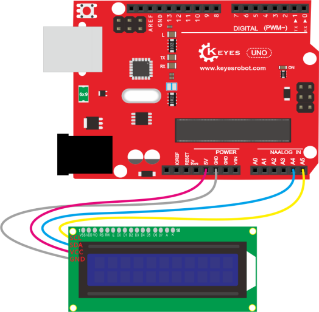

连接Keyes 2560 R3

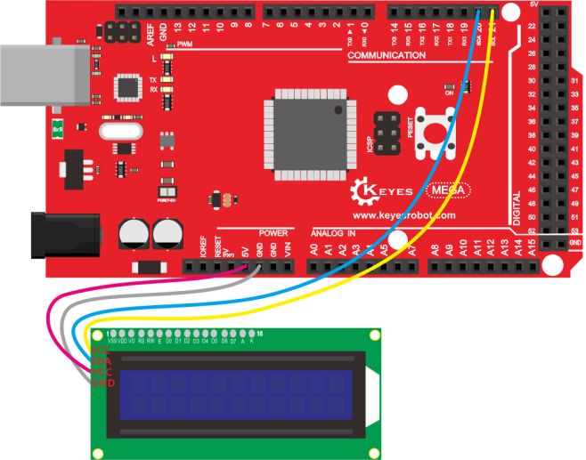

测试代码

```
// 引入必要的库文件
#include <Wire.h>                 // I2C通信库
#include <LiquidCrystal_I2C.h>    // I2C LCD控制库

// 初始化LCD对象
// 参数说明：0x27是I2C地址，16字符宽度，2行显示
LiquidCrystal_I2C lcd(0x27,16,2);  

// 初始化设置函数
void setup()
{
  // 初始化LCD显示屏
  lcd.init();                     // 第一次初始化
  lcd.init();                     // 第二次初始化（重复初始化可能是个笔误）
  
  // 开启LCD背光
  lcd.backlight();
  
  // 设置光标位置并显示第一行文字
  // 参数说明：(列位置, 行位置)
  lcd.setCursor(2,0);             // 第0行第2列
  lcd.print("Hello, world!");     // 打印"Hello, world!"
  
  // 设置光标位置并显示第二行文字
  lcd.setCursor(2,1);             // 第1行第2列
  lcd.print("Hello, keyes!");     // 打印"Hello, keyes!"
}

// 主循环函数
void loop()
{
  // 此处为空，因为只需要初始化时显示一次内容
  // 如果需要动态内容可以在这里添加代码
}
```


测试结果

按照接线方法接好线，烧录好代码，上电后，通电后，旋转模块电位器调节背光，LCD上第一行和第二行分别显示"Hello, world!"和"Hello, keyes!"字符。

## 实验十九 超声波测距显示实验

实验说明

超声波传感器主要用于测距，它具有高精度、盲区（2cm）超近、性能稳定的特点。本实验中我们主要用到了超声波传感器和1602 I2C 蓝屏。实验中我们通过超声波测到超声波与前方障碍物的距离，然后在1602 I2C 蓝屏上显示测试结果。

实验器材

开发板\*1

USB线\*1

1602 I2C 蓝屏\*1

超声波传感器\*1

面包板\*1

面包板连接线若干

杜邦线若干

接线图

连接Keyes UNO R3

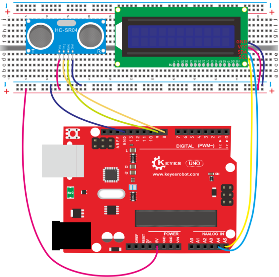

连接Keyes UNO R3

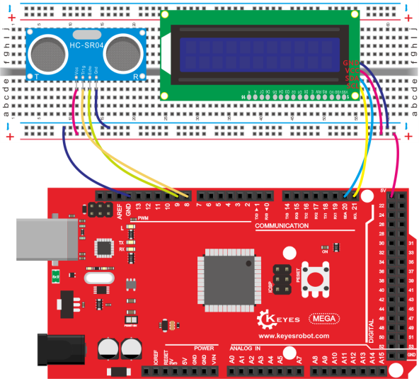

测试代码

```
// 引入必要的库文件
#include <Wire.h>                 // I2C通信库
#include <LiquidCrystal_I2C.h>    // I2C LCD控制库

// 初始化LCD对象(地址0x27，16列2行)
LiquidCrystal_I2C lcd(0x27,16,2);

// 定义超声波传感器引脚
#define echoPin 9   // 回声信号接收引脚
#define trigPin 8   // 触发信号发送引脚
#define LEDPin 13   // 板载LED指示灯引脚

// 定义测量范围
int maximumRange = 200; // 最大测量距离(cm)
int minimumRange = 0;   // 最小测量距离(cm)

// 定义测量变量
long duration, distance; // 持续时间和计算出的距离

void setup() {
  // 初始化各引脚模式
  pinMode(trigPin, OUTPUT);  // 触发引脚设为输出
  pinMode(echoPin, INPUT);   // 回声引脚设为输入
  pinMode(LEDPin, OUTPUT);   // LED引脚设为输出
  
  // 初始化LCD显示屏
  lcd.init();                // 初始化LCD
  lcd.backlight();           // 开启背光
  
  // 显示固定标题
  lcd.setCursor(0,0);        // 设置光标位置(第0行第0列)
  lcd.print("The distance is:"); // 打印固定文字
}

void loop() {
  // 超声波测距过程
  digitalWrite(trigPin, LOW);    // 先拉低触发引脚
  delayMicroseconds(2);          // 等待2微秒
  digitalWrite(trigPin, HIGH);   // 发送10微秒的高电平脉冲
  delayMicroseconds(10);
  digitalWrite(trigPin, LOW);
  
  // 测量回声高电平持续时间
  duration = pulseIn(echoPin, HIGH);
  
  // 计算距离(单位:cm)
  distance = duration/58.2;      // 根据声速换算距离
  
  // 处理测量结果
  if (distance >= maximumRange || distance <= minimumRange){
    // 超出测量范围的处理
    lcd.setCursor(0,1);          // 设置光标位置(第1行第0列)
    lcd.print("-1     ");        // 显示-1表示超出范围
    digitalWrite(LEDPin, HIGH);  // 点亮LED表示异常
  }
  else {
    // 正常范围内的处理
    if(distance < 10) {
      // 个位数距离显示处理
      lcd.setCursor(0,1);
      lcd.print(distance);       // 显示距离值
      lcd.setCursor(1,1);
      lcd.print("  ");           // 清除多余字符
    }
    else if((distance >=10) && (distance<100)) {
      // 两位数距离显示处理
      lcd.setCursor(0,1);
      lcd.print(distance);
      lcd.setCursor(2,1);
      lcd.print("  ");           // 清除多余字符
    }
    else if(distance >= 100) {
      // 三位数距离显示处理
      lcd.setCursor(0,1);
      lcd.print(distance);
    }
    digitalWrite(LEDPin, LOW);   // 关闭LED表示正常
  }
  
  // 延时50ms后进行下一次测量
  delay(50);
}
```


测试结果

按照上图接好线，烧录好代码，旋转电位器调节好背光后，1602 I2C
蓝屏显示"The distance is:"字符；测试超声波与前方障碍物的距离，测试到数据，则在1602 I2C
蓝屏上显示该数据，若没测试到数据，那么就在1602 I2C
蓝屏上显示”-1”字符。

## 实验二十 1302时钟显示实验

实验说明

上一实验中我们在1602 I2C 蓝屏上显示超声波距离，这一实验程也是将1602 I2C 蓝屏做显示器。这个实验中我们利用1302时钟模块和1602 I2C
蓝屏自制一个时钟，时钟上包含年、月、日、星期、小时、分钟、秒。初始时间在代码中设置，时钟自动行走，在1602 I2C 蓝屏显示。

实验器材

开发板\*1

USB线\*1

1602 I2C 蓝屏\*1

1302时钟模块\*1

面包板\*1

面包板连接线若干

杜邦线若干

接线图

连接Keyes UNO R3

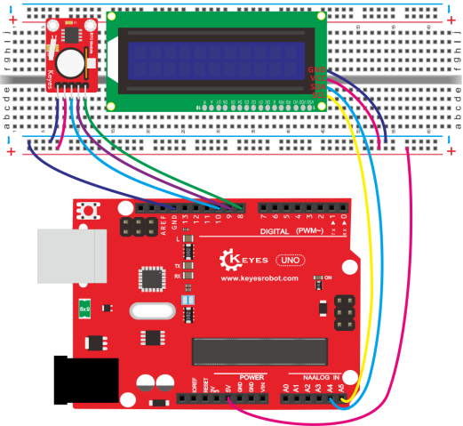

连接Keyes 2560 R3

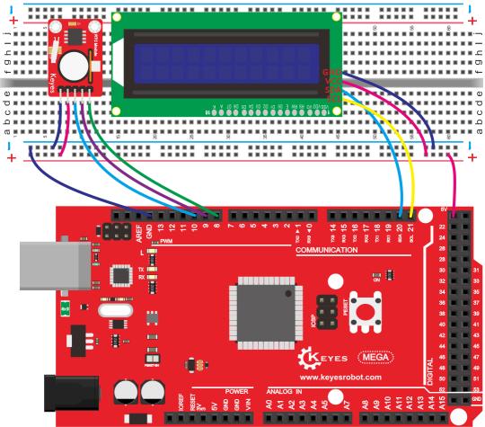

测试代码

```
// 引入必要的库文件
#include <stdio.h>               // 标准输入输出库
#include <string.h>              // 字符串处理库
#include <DS1302.h>              // DS1302时钟模块库
#include <Wire.h>                // I2C通信库
#include <LiquidCrystal_I2C.h>   // I2C LCD控制库

// 初始化LCD对象(地址0x27，16列2行)
LiquidCrystal_I2C lcd(0x27,16,2);

// 定义DS1302时钟模块引脚连接
uint8_t CE_PIN   = 10;    // RST复位引脚
uint8_t IO_PIN   = 9;     // DAT数据引脚
uint8_t SCLK_PIN = 8;     // CLK时钟引脚

// 创建显示缓冲区
char buf[50];   // 完整时间信息缓冲区
char bf[50];    // 日期和年份缓冲区
char bu[50];    // 时间缓冲区
char uf[50];    // 月份和日期缓冲区
char day[10];   // 星期缓冲区

// 创建DS1302对象
DS1302 rtc(CE_PIN, IO_PIN, SCLK_PIN);

// 时间显示函数
void print_time()
{
  // 从芯片获取当前时间和日期
  Time t = rtc.time();

  // 将星期数字转换为字符串
  memset(day, 0, sizeof(day));  // 清空星期缓冲区
  switch (t.day) {
    case 1: strcpy(day, "Sunday   "); break;
    case 2: strcpy(day, "Monday   "); break;
    case 3: strcpy(day, "Tuesday  "); break;
    case 4: strcpy(day, "Wednesday"); break;
    case 5: strcpy(day, "Thursday "); break;
    case 6: strcpy(day, "Friday   "); break;
    case 7: strcpy(day, "Saturday "); break;
  }

  // 格式化完整时间字符串并存入缓冲区
  snprintf(buf, sizeof(buf), "%s %04d-%02d-%02d %02d:%02d:%02d",
           day, t.yr, t.mon, t.date, t.hr, t.min, t.sec);
  Serial.println(buf);  // 串口输出完整时间

  // 格式化LCD第一行显示内容(星期和年份)
  snprintf(bf, sizeof(bf), "%s  %04d", day, t.yr);
  lcd.setCursor(0,0);   // 设置光标位置(第0行第0列)
  lcd.print(bf);        // 显示星期和年份

  // 格式化LCD第二行时间显示(时:分:秒)
  snprintf(bu, sizeof(bu), "%02d:%02d:%02d", t.hr, t.min, t.sec);
  lcd.setCursor(0,1);   // 设置光标位置(第1行第0列)
  lcd.print(bu);        // 显示时间

  // 格式化LCD第二行日期显示(月-日)
  snprintf(uf, sizeof(uf), "%02d-%02d", t.mon, t.date);
  lcd.setCursor(11,1);  // 设置光标位置(第1行第11列)
  lcd.print(uf);        // 显示月份和日期
}

// 初始化设置
void setup()
{
  // 初始化LCD显示屏
  lcd.init();           // 初始化LCD
  lcd.backlight();      // 开启背光
  
  // 初始化串口通信
  Serial.begin(9600);

  // 初始化DS1302时钟模块
  rtc.write_protect(false);  // 关闭写保护
  rtc.halt(false);          // 清除时钟停止标志

  // 设置初始时间(2017年10月24日，星期二，10:11:22)
  Time t(2017,10,24,10,11,22,3);
  rtc.time(t);  // 写入时间到DS1302
}

// 主循环
void loop()
{
  print_time();  // 每秒更新时间显示
  delay(1000);   // 延时1秒
}
```


测试结果

按照上图接好线，烧录好代码，旋转电位器调节好背光后，1602 I2C
蓝屏显示当前初始时间，然后时钟开始走动。

## 实验二十一 人体红外感应实验

实验说明

和上面两个实验一样，这个实验也是用1602 I2C
蓝屏做显示器。实验中，我们用到了人体红外热释电传感器。人体红外热释电传感器是基于红外线技术的自动控制产品。它具有灵敏度高、可靠性强、超低功耗，超低电压工作模式等特点。

当检测到有人有附近移动时，在1602 I2C
蓝屏显示对应字符，当没有检测到人体在附件移动时，1602 I2C
蓝屏显示另一对应字符。

实验器材

开发板\*1

USB线\*1

LED\*1

220Ω 电阻\*1

1602 I2C 蓝屏\*1

人体红外热释电传感器\*1

面包板\*1

面包板连接线若干

杜邦线若干

接线图

连接Keyes UNO R3

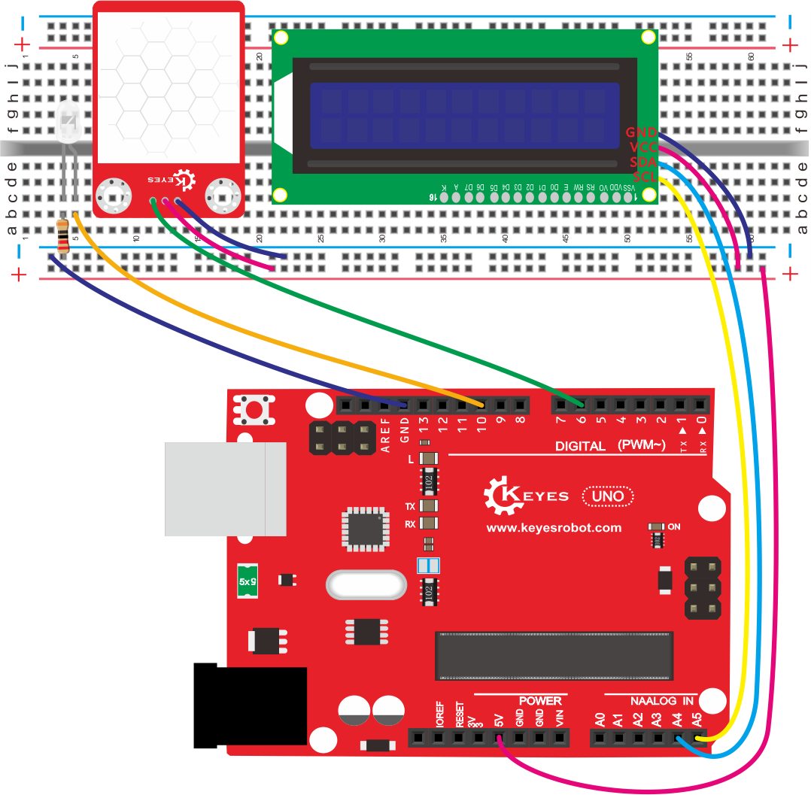

连接Keyes 2560 R3

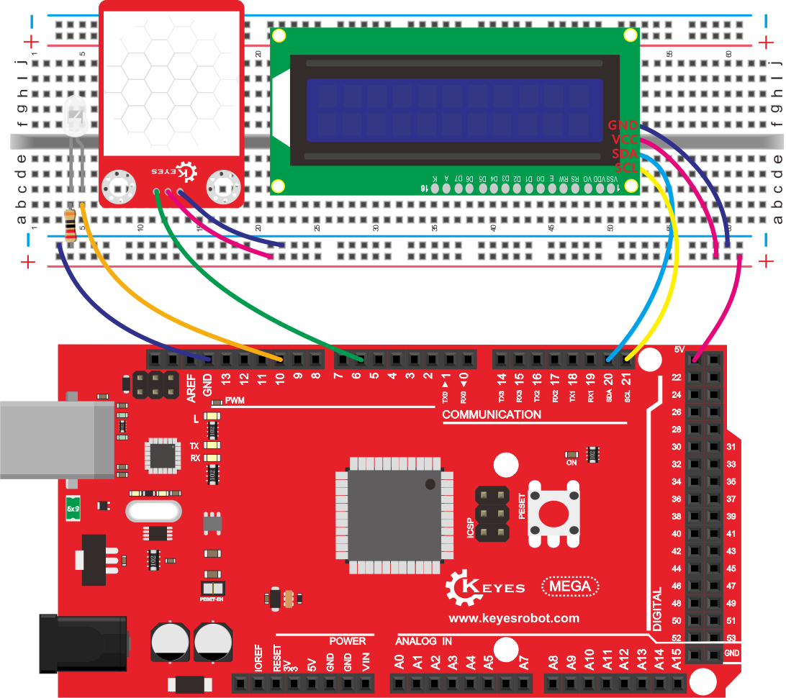

测试代码


```
// include the library code:
#include <Wire.h> 
#include <LiquidCrystal_I2C.h>
LiquidCrystal_I2C lcd(0x27,16,2);
byte sensorPin = 6;//定义数字口6
byte indicator = 10;//定义数字口10
void setup()
{
  pinMode(sensorPin,INPUT);//设置数字口6位输入
  pinMode(indicator,OUTPUT);//设置数字口10为输出
    lcd.init();                      // initialize the lcd 
  // Print a message to the LCD.
  lcd.init();
  lcd.backlight();
}
void loop()
{
  byte state = digitalRead(sensorPin);//读取到数字口6的数值赋值给state
  digitalWrite(indicator,state);//控制数字口10的状态
  if(state == 1)//当数值口6位高电平时，串口监视器输出对应字符，并自动换行
 {
  lcd.setCursor(0,0);
  lcd.print("Somebody is");
  lcd.setCursor(0,1);
  lcd.print("in this area!");
  }
  else if(state == 0) //当数值口6位低电平时，串口监视器输出对应字符，并自动换行
  {
  lcd.setCursor(0,0);
  lcd.print("No one!      ");
  lcd.setCursor(0,1);
  lcd.print("No one!      ");
  }
  delay(500);//延迟0.5S
}
```


测试结果

按照上图接好线，烧录好代码，旋转电位器调节好背光后，当检测到有人有附近移动时，在1602 LCD第一行显示显示"Somebody is "字符，第二行显示"in this area!"字符，LED亮起；当没有检测到人体在附件移动时，1602 LCD两行都显示"No one!"字符，LED熄灭。

## 实验二十二 4x4按键显示实验 

实验说明

为了节约单片机I/O口，我们将多个按键做成矩阵键盘。本实验中用到了一个4x4按键矩阵，实验中，当我们按下矩阵中按键后，串口监视器中会显示对应字符。

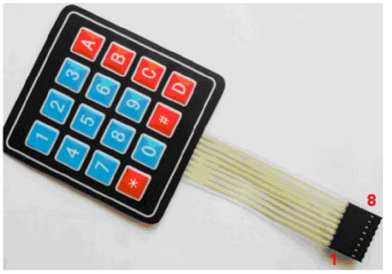

4\*4 薄膜按键脚位，请看上图。 其原理图如下

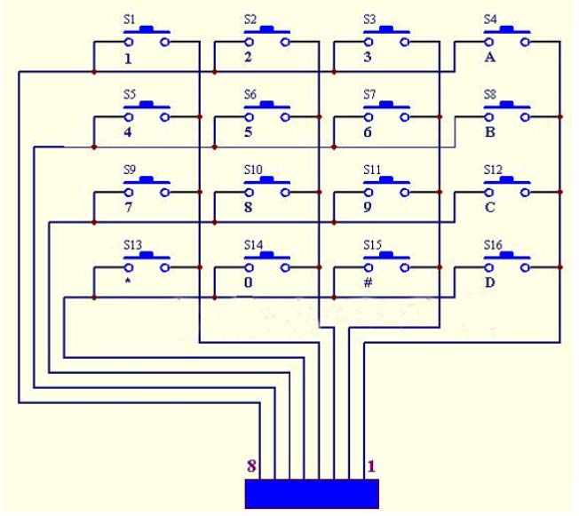

实验器材

开发板 \*1

USB线\*1

4\*4 薄膜按键\*1

面包板连接线若干

接线方法

连接Keyes UNO R3

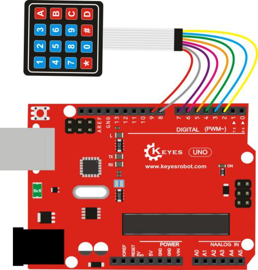

连接Keyes 2560 R3

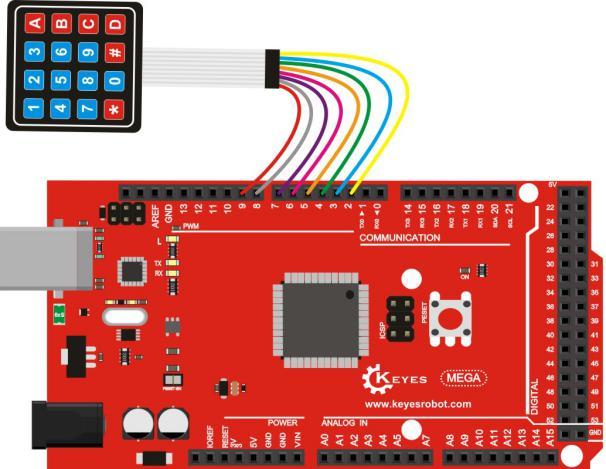

测试代码

```
#include <Keypad.h>
const byte ROWS = 4; //定义 4 行
const byte COLS = 4; //定义 4 列
char keys[ROWS][COLS] = {
{'1','2','3','A'},
{'4','5','6','B'},
{'7','8','9','C'},
{'*','0','#','D'}
};
//连接 4*4 按键的行位端口，相应控制板的数字 IO 口
byte rowPins[ROWS] = {9,8,7,6};
//连接 4*4 按键的列位端口，相应控制板的数字 IO 口
byte colPins[COLS] = {5,4,3,2};
//调用 Keypad 类库功能函数
Keypad keypad = Keypad( makeKeymap(keys), rowPins, colPins, ROWS, COLS );
void setup(){
Serial.begin(9600);
}
void loop(){
char key = keypad.getKey();
if (key != NO_KEY){
Serial.println(key);
}
}
```


测试结果

将程序下载到实验板后，打开串口监视器， 此时按下键盘上的某个键，
在串口工具上显示该按键的值，如下图。

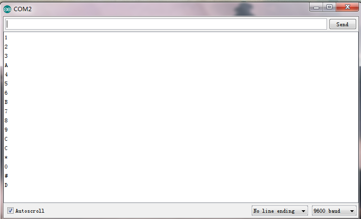

## 实验二十三 步进电机实验

实验说明

步进电机是一种将电脉冲转化为角位移的执行机构。通俗一点讲：当步进驱动器接收到

一个脉冲信号，它就驱动步进电机按设定的方向转动一个固定的角度（及步进角）。你

可以通过控制脉冲个数来控制角位移量，从而达到准确定位的目的；同时你也可以通过

控制脉冲频率来控制电机转动的速度和加速度，从而达到调速的目的。

下面这个就是本次实验使用的步进电机

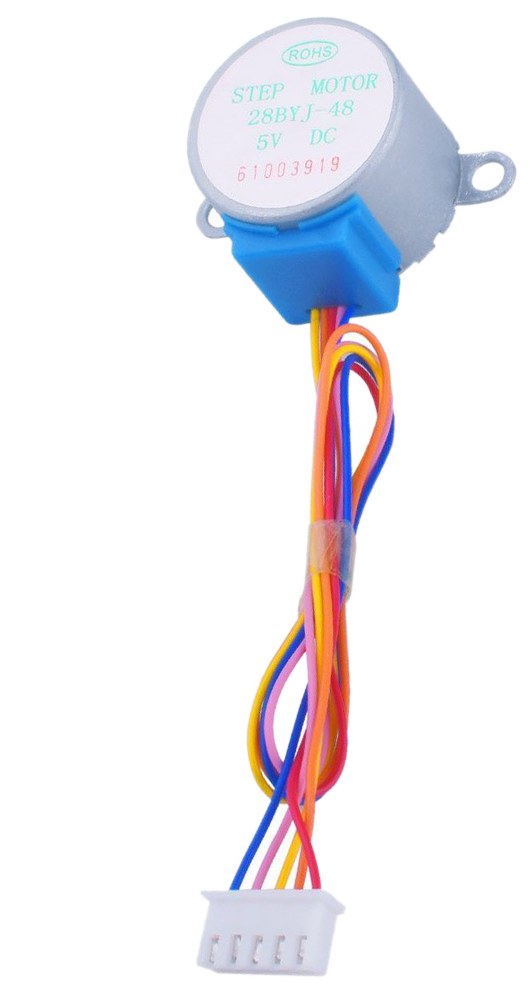

减速步进电机

直径：28mm

电压：5V

步进角度：5.625 x 1/64

减速比：1/64

5线4相 可以用普通uln2003芯片驱动，也可以接成2相使用

该步进电机空载耗电在50mA以下，带64倍减速器，输出力矩比较大，可以驱动重负

载，极适合开发板使用。注意：此款步进电机带有64倍减速器，与不带减速器的步进

电机相比，转速显得较慢，为方便观察，可在输出轴处粘上一片小纸板。


步进电机(五线四相）驱动板(UL2003)试验板


实验器材

开发板\*1

USB线\*1

减速步进电机\*1

UL2003\*1

杜邦线若干

接线图

连接Keyes UNO R3


连接Keyes 2560 R3


测试代码

```
#include <Stepper.h>
//这里设置步进电机旋转一圈是多少步
#define STEPS 100
//设置步进电机的步数和引脚
Stepper stepper(STEPS, 11, 10, 9, 8);
//定义变量用来存储历史读数
int previous = 0;
void setup()
{
 //设置电机每分钟的转速为90步
  stepper.setSpeed(90);
}
void loop()
{
 //获取传感器读数
 int val = analogRead(0);
 //移动步数为当前读数减去历史读数
 stepper.step(val - previous);
 //保存历史读数
 previous = val;
}
```


测试结果

按照上图接好线，烧录好代码，上电后，5V步进电机转动，转动速度很慢。

## 实验二十四 舵机控制实验

实验说明

舵机是一种位置伺服的驱动器，主要是由外壳、电路板、无核心马达、齿轮与位置检测

器所构成。舵机有很多规格，但所有的舵机都有外接三根线，分别用棕、红、橙三种颜

色进行区分，由于舵机品牌不同，颜色也会有所差异，棕色为接地线，红色为电源正极

线，橙色为信号线。


舵机的转动的角度是通过调节PWM（脉冲宽度调制）信号的占空比来实现的，标准PWM

（脉冲宽度调制）信号的周期固定为20ms（50Hz），理论上脉宽分布应在1ms到2ms

之间，但是，事实上脉宽可由0.5ms 到2.5ms 之间，脉宽和舵机的转角0°～180°相

对应。有一点值得注意的地方，由于舵机牌子不同，对于同一信号，不同牌子的舵机旋

转的角度也会有所不同。


实验器材

开发板\*1

USB线\*1

舵机\*1

面包线若干

接线图

连接Keyes UNO R3


连接Keyes 2560 R3

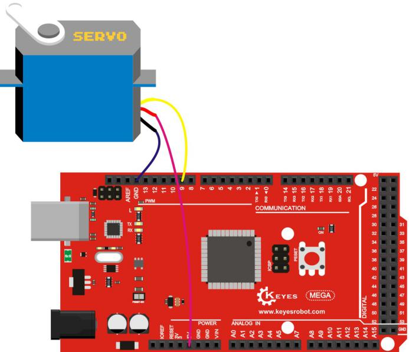

测试代码

程序A：

```
int servopin=9;//定义数字接口9 连接伺服舵机信号线
int myangle;//定义角度变量
int pulsewidth;//定义脉宽变量
int val;
void servopulse(int servopin,int myangle)//定义一个脉冲函数
{
pulsewidth=(myangle*11)+500;//将角度转化为500-2480 的脉宽值
digitalWrite(servopin,HIGH);//将舵机接口电平至高
delayMicroseconds(pulsewidth);//延时脉宽值的微秒数
digitalWrite(servopin,LOW);//将舵机接口电平至低
delay(20-pulsewidth/1000);
}
void setup()
{
pinMode(servopin,OUTPUT);//设定舵机接口为输出接口
Serial.begin(9600);//连接到串行端口，波特率为9600
Serial.println("servo=o_seral_simple ready" ) ;
}
void loop()//将0 到9 的数转化为0 到180 角度，并让LED 闪烁相应数的次数
{
val=Serial.read();//读取串行端口的值
if(val>='0'&&val<='9')
{
val=val-'0';//将特征量转化为数值变量
val=val*(180/9);//将数字转化为角度
Serial.print("moving servo to ");
Serial.print(val,DEC);
Serial.println();
for(int i=0;i<=50;i++) //给予舵机足够的时间让它转到指定角度
{
servopulse(servopin,val);//引用脉冲函数
}
}
}
```

程序B：

```
#include <Servo.h>
Servo myservo;//定义舵机变量名
void setup()
{
myservo.attach(9);//定义舵机接口（9、10 都可以，缺点只能控制2 个）
}
void loop()
{
myservo.write(90);//设置舵机旋转的角度
}
```

测试结果

程序A 结果：

在串口监视器中输入数字点击发送，舵机转动到所对应的角度数的位置，并将角度打印显示到屏幕上。

程序B结果：

舵机自己转动到90度位置。

## 实验二十五 RFID读卡器实验

实验说明

射频技术也简称 RFID,RFID 是英文 radio frequency identification”的缩写，叫做射频识

别技术，简称射频技术。本实验只是用RFID模块读取IC卡和钥匙扣中的内容。RFID模块，一定要使用+3.3V
供电，否则会烧掉模块。

实验器材

开发板\*1

USB线\*1

RFID－RC522 射频模块\*1

IC卡\*1

钥匙扣\*1

杜邦线若干

接线图

连接Keyes UNO R3

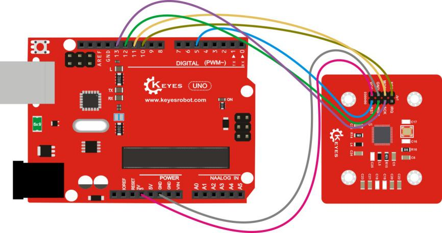

连接Keyes 2560 R3

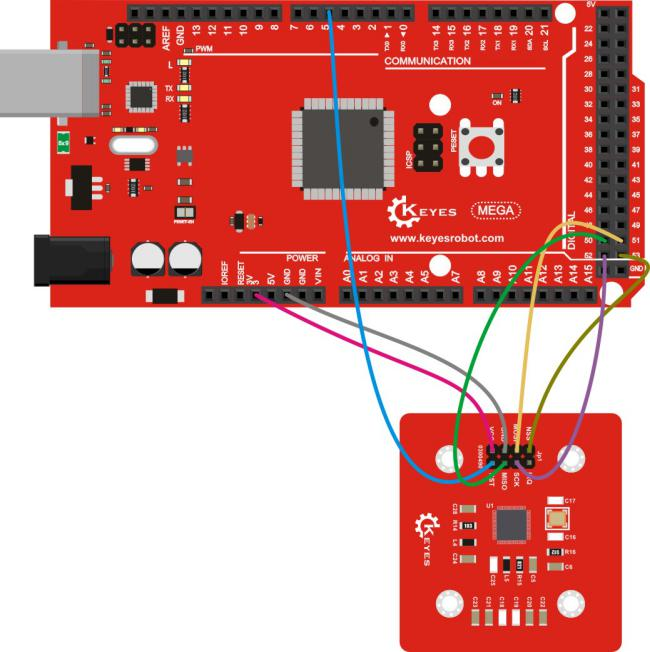

测试代码

```
#include <SPI.h>
#define uchar unsigned char
#define uint unsigned int
#define MAX_LEN 16

// 引脚定义
const int chipSelectPin = 10;  // UNO,328,168控制器使用10引脚
//const int chipSelectPin = 53; // MEGA 2560控制器使用53引脚
const int NRSTPD = 5;

// MF522命令字
#define PCD_IDLE 0x00         // 无动作，取消当前命令
#define PCD_AUTHENT 0x0E      // 验证密钥
#define PCD_RECEIVE 0x08      // 接收数据
#define PCD_TRANSMIT 0x04     // 发送数据
#define PCD_TRANSCEIVE 0x0C   // 接收和发送数据
#define PCD_RESETPHASE 0x0F   // 复位
#define PCD_CALCCRC 0x03      // CRC计算

// Mifare_One卡片命令字
#define PICC_REQIDL 0x26      // 寻卡区域处于休眠状态
#define PICC_REQALL 0x52      // 寻卡区域受到干扰
#define PICC_ANTICOLL 0x93    // 防冲突
#define PICC_SElECTTAG 0x93   // 选卡
#define PICC_AUTHENT1A 0x60   // 验证A密钥
#define PICC_AUTHENT1B 0x61   // 验证B密钥
#define PICC_READ 0x30        // 读块
#define PICC_WRITE 0xA0       // 写块
#define PICC_DECREMENT 0xC0   
#define PICC_INCREMENT 0xC1   
#define PICC_RESTORE 0xC2     // 将数据转移到缓冲区
#define PICC_TRANSFER 0xB0    // 保存缓冲区数据
#define PICC_HALT 0x50        // 休眠

// MF522通信返回错误码
#define MI_OK 0
#define MI_NOTAGERR 1
#define MI_ERR 2

//------------------MFRC522寄存器---------------
// 第0页:命令和状态
#define Reserved00 0x00    
#define CommandReg 0x01    
#define CommIEnReg 0x02    
#define DivlEnReg 0x03    
#define CommIrqReg 0x04    
#define DivIrqReg 0x05
#define ErrorReg 0x06    
#define Status1Reg 0x07    
#define Status2Reg 0x08    
#define FIFODataReg 0x09
#define FIFOLevelReg 0x0A
#define WaterLevelReg 0x0B
#define ControlReg 0x0C
#define BitFramingReg 0x0D
#define CollReg 0x0E
#define Reserved01 0x0F

// 第1页:命令     
#define Reserved10 0x10
#define ModeReg 0x11
#define TxModeReg 0x12
#define RxModeReg 0x13
#define TxControlReg 0x14
#define TxAutoReg 0x15
#define TxSelReg 0x16
#define RxSelReg 0x17
#define RxThresholdReg 0x18
#define DemodReg 0x19
#define Reserved11 0x1A
#define Reserved12 0x1B
#define MifareReg 0x1C
#define Reserved13 0x1D
#define Reserved14 0x1E
#define SerialSpeedReg 0x1F

// 第2页:配置    
#define Reserved20 0x20  
#define CRCResultRegM 0x21
#define CRCResultRegL 0x22
#define Reserved21 0x23
#define ModWidthReg 0x24
#define Reserved22 0x25
#define RFCfgReg 0x26
#define GsNReg 0x27
#define CWGsPReg 0x28
#define ModGsPReg 0x29
#define TModeReg 0x2A
#define TPrescalerReg 0x2B
#define TReloadRegH 0x2C
#define TReloadRegL 0x2D
#define TCounterValueRegH 0x2E
#define TCounterValueRegL 0x2F

// 第3页:测试寄存器     
#define Reserved30 0x30
#define TestSel1Reg 0x31
#define TestSel2Reg 0x32
#define TestPinEnReg 0x33
#define TestPinValueReg 0x34
#define TestBusReg 0x35
#define AutoTestReg 0x36
#define VersionReg 0x37
#define AnalogTestReg 0x38
#define TestDAC1Reg 0x39  
#define TestDAC2Reg 0x3A   
#define TestADCReg 0x3B   
#define Reserved31 0x3C   
#define Reserved32 0x3D   
#define Reserved33 0x3E   
#define Reserved34 0x3F

// 全局变量
uchar serNum[5];
uchar writeDate[16] = {'T', 'e', 'n', 'g', ' ', 'B', 'o', 0, 0, 0, 0, 0, 0, 0, 0, 0};

// 扇区密钥A
uchar sectorKeyA[16][16] = {
    {0xFF, 0xFF, 0xFF, 0xFF, 0xFF, 0xFF},
    {0xFF, 0xFF, 0xFF, 0xFF, 0xFF, 0xFF},
    {0xFF, 0xFF, 0xFF, 0xFF, 0xFF, 0xFF},
};

// 新扇区密钥A
uchar sectorNewKeyA[16][16] = {
    {0xFF, 0xFF, 0xFF, 0xFF, 0xFF, 0xFF},
    {0xFF, 0xFF, 0xFF, 0xFF, 0xFF, 0xFF, 0xff, 0x07, 0x80, 0x69, 0xFF, 0xFF, 0xFF, 0xFF, 0xFF, 0xFF},
    {0xFF, 0xFF, 0xFF, 0xFF, 0xFF, 0xFF, 0xff, 0x07, 0x80, 0x69, 0xFF, 0xFF, 0xFF, 0xFF, 0xFF, 0xFF},
};

void setup()
{
    Serial.begin(9600);  // RFID读卡器SOUT引脚连接到串口RX引脚，波特率2400bps
    
    // 初始化SPI库
    SPI.begin();
    
    // 设置数字引脚10为输出，连接到RFID的/ENABLE引脚
    pinMode(chipSelectPin, OUTPUT);
    digitalWrite(chipSelectPin, LOW);  // 激活RFID读卡器
    
    pinMode(NRSTPD, OUTPUT);  // 设置数字引脚5，用于复位和掉电控制
    digitalWrite(NRSTPD, HIGH);

    MFRC522_Init();  // 初始化MFRC522
}

void loop()
{
    uchar i, tmp;
    uchar status;
    uchar str[MAX_LEN];
    uchar RC_size;
    uchar blockAddr;  // 操作块地址0～63

    // 寻卡，返回卡片类型
    status = MFRC522_Request(PICC_REQIDL, str);
    if (status == MI_OK)
    {
    }
    
    // 防冲突，获取卡片序列号
    status = MFRC522_Anticoll(str);
    memcpy(serNum, str, 5);
    if (status == MI_OK)
    {
        Serial.println("The card's number is: ");
        Serial.print(serNum[0], BIN);
        Serial.print(serNum[1], BIN);
        Serial.print(serNum[2], BIN);
        Serial.print(serNum[3], BIN);
        Serial.print(serNum[4], BIN);
        Serial.println(" ");
    }

    // 选卡，返回卡片容量
    RC_size = MFRC522_SelectTag(serNum);
    if (RC_size != 0)
    {
    }
    
    // 写卡数据
    blockAddr = 7;  // 数据块7
    status = MFRC522_Auth(PICC_AUTHENT1A, blockAddr, sectorKeyA[blockAddr/4], serNum);  // 验证
    if (status == MI_OK)
    {
        // 写数据
        status = MFRC522_Write(blockAddr, sectorNewKeyA[blockAddr/4]);
        Serial.print("set the new card password, and can modify the data of the Sector: ");
        Serial.print(blockAddr/4, DEC);
   
        // 写数据
        blockAddr = blockAddr - 3;
        status = MFRC522_Write(blockAddr, writeDate);
        if (status == MI_OK)
        {
            Serial.println("OK!");
        }
    }

    // 读卡
    blockAddr = 7;  // 数据块7
    status = MFRC522_Auth(PICC_AUTHENT1A, blockAddr, sectorNewKeyA[blockAddr/4], serNum);  // 验证
    if (status == MI_OK)
    {
        // 读数据
        blockAddr = blockAddr - 3;
        status = MFRC522_Read(blockAddr, str);
        if (status == MI_OK)
        {
            Serial.println("Read from the card, the data is: ");
            for (i = 0; i < 16; i++)
            {
                Serial.print(str[i]);
            }
            Serial.println(" ");
        }
    }
    Serial.println(" ");
    MFRC522_Halt();  // 命令卡片进入休眠模式
}

// 写MFRC522寄存器
void Write_MFRC522(uchar addr, uchar val)
{
    digitalWrite(chipSelectPin, LOW);
    SPI.transfer((addr << 1) & 0x7E);  // 地址格式:0XXXXXX0
    SPI.transfer(val);
    digitalWrite(chipSelectPin, HIGH);
}

// 读MFRC522寄存器
uchar Read_MFRC522(uchar addr)
{
    uchar val;
    digitalWrite(chipSelectPin, LOW);
    SPI.transfer(((addr << 1) & 0x7E) | 0x80);  // 地址格式:1XXXXXX0
    val = SPI.transfer(0x00);
    digitalWrite(chipSelectPin, HIGH);
    return val;
}

// 设置寄存器位掩码
void SetBitMask(uchar reg, uchar mask)
{
    uchar tmp;
    tmp = Read_MFRC522(reg);
    Write_MFRC522(reg, tmp | mask);  // 设置位掩码
}

// 清除寄存器位掩码
void ClearBitMask(uchar reg, uchar mask)
{
    uchar tmp;
    tmp = Read_MFRC522(reg);
    Write_MFRC522(reg, tmp & (~mask));  // 清除位掩码
}

// 开启天线
void AntennaOn(void)
{
    uchar temp;
    temp = Read_MFRC522(TxControlReg);
    if (!(temp & 0x03))
    {
        SetBitMask(TxControlReg, 0x03);
    }
}

// 关闭天线
void AntennaOff(void)
{
    ClearBitMask(TxControlReg, 0x03);
}

// 复位MFRC522
void MFRC522_Reset(void)
{
    Write_MFRC522(CommandReg, PCD_RESETPHASE);
}

// 初始化MFRC522
void MFRC522_Init(void)
{
    digitalWrite(NRSTPD, HIGH);
    MFRC522_Reset();
    
    // 定时器配置: TPrescaler*TreloadVal/6.78MHz = 24ms
    Write_MFRC522(TModeReg, 0x8D);       // Tauto=1; f(Timer) = 6.78MHz/TPreScaler
    Write_MFRC522(TPrescalerReg, 0x3E);  // TModeReg[3..0] + TPrescalerReg
    Write_MFRC522(TReloadRegL, 30);           
    Write_MFRC522(TReloadRegH, 0);
    
    Write_MFRC522(TxAutoReg, 0x40);  // 100%ASK调制
    Write_MFRC522(ModeReg, 0x3D);    // CRC初始值0x6363
    
    AntennaOn();  // 开启天线
}

// 寻卡
uchar MFRC522_Request(uchar reqMode, uchar *TagType)
{
    uchar status;  
    uint backBits;  // 接收到的数据位数
    
    Write_MFRC522(BitFramingReg, 0x07);  // TxLastBists = BitFramingReg[2..0]
    
    TagType[0] = reqMode;
    status = MFRC522_ToCard(PCD_TRANSCEIVE, TagType, 1, TagType, &backBits);

    if ((status != MI_OK) || (backBits != 0x10))
    {    
        status = MI_ERR;
    }
   
    return status;
}

// MFRC522与卡片通信
uchar MFRC522_ToCard(uchar command, uchar *sendData, uchar sendLen, uchar *backData, uint *backLen)
{
    uchar status = MI_ERR;
    uchar irqEn = 0x00;
    uchar waitIRq = 0x00;
    uchar lastBits;
    uchar n;
    uint i;

    switch (command)
    {
        case PCD_AUTHENT:  // 卡片密钥验证
        {
            irqEn = 0x12;
            waitIRq = 0x10;
            break;
        }
        case PCD_TRANSCEIVE:  // 发送FIFO中的数据
        {
            irqEn = 0x77;
            waitIRq = 0x30;
            break;
        }
        default:
            break;
    }
   
    Write_MFRC522(CommIEnReg, irqEn | 0x80);  // 允许中断请求
    ClearBitMask(CommIrqReg, 0x80);           // 清除所有中断请求位
    SetBitMask(FIFOLevelReg, 0x80);           // FlushBuffer=1, FIFO初始化
    
    Write_MFRC522(CommandReg, PCD_IDLE);  // 无动作，清除当前命令
    
    // 将数据写入FIFO
    for (i = 0; i < sendLen; i++)
    {   
        Write_MFRC522(FIFODataReg, sendData[i]);    
    }

    // 执行命令
    Write_MFRC522(CommandReg, command);
    if (command == PCD_TRANSCEIVE)
    {    
        SetBitMask(BitFramingReg, 0x80);  // StartSend=1,开始传输数据
    }   
    
    // 等待数据传输完成
    i = 2000;  // 根据时钟频率调整i，M1卡操作最大等待时间25ms
    do 
    {
        // CommIrqReg[7..0]
        // Set1 TxIRq RxIRq IdleIRq HiAlerIRq LoAlertIRq ErrIRq TimerIRq
        n = Read_MFRC522(CommIrqReg);
        i--;
    }
    while ((i != 0) && !(n & 0x01) && !(n & waitIRq));

    ClearBitMask(BitFramingReg, 0x80);  // StartSend=0
    
    if (i != 0)
    {    
        if (!(Read_MFRC522(ErrorReg) & 0x1B))  // BufferOvfl Collerr CRCErr ProtecolErr
        {
            status = MI_OK;
            if (n & irqEn & 0x01)
            {   
                status = MI_NOTAGERR;  // 无卡片错误
            }

            if (command == PCD_TRANSCEIVE)
            {
                n = Read_MFRC522(FIFOLevelReg);
                lastBits = Read_MFRC522(ControlReg) & 0x07;
                if (lastBits)
                {   
                    *backLen = (n - 1) * 8 + lastBits;   
                }
                else
                {   
                    *backLen = n * 8;   
                }

                if (n == 0)
                {   
                    n = 1;    
                }
                if (n > MAX_LEN)
                {   
                    n = MAX_LEN;   
                }
                
                // 读取FIFO中接收到的数据
                for (i = 0; i < n; i++)
                {   
                    backData[i] = Read_MFRC522(FIFODataReg);    
                }
            }
        }
        else
        {   
            status = MI_ERR;  
        }
    }
    
    return status;
}

// 防冲突，获取卡片序列号
uchar MFRC522_Anticoll(uchar *serNum)
{
    uchar status;
    uchar i;
    uchar serNumCheck = 0;
    uint unLen;
    
    Write_MFRC522(BitFramingReg, 0x00);  // TxLastBists = BitFramingReg[2..0]
 
    serNum[0] = PICC_ANTICOLL;
    serNum[1] = 0x20;
    status = MFRC522_ToCard(PCD_TRANSCEIVE, serNum, 2, serNum, &unLen);

    if (status == MI_OK)
    {
        // 验证卡片序列号
        for (i = 0; i < 4; i++)
        {   
            serNumCheck ^= serNum[i];
        }
        if (serNumCheck != serNum[i])
        {   
            status = MI_ERR;    
        }
    }

    return status;
}

// 计算CRC
void CalulateCRC(uchar *pIndata, uchar len, uchar *pOutData)
{
    uchar i, n;

    ClearBitMask(DivIrqReg, 0x04);  // CRCIrq = 0
    SetBitMask(FIFOLevelReg, 0x80); // 清除FIFO指针
    
    // 将数据写入FIFO
    for (i = 0; i < len; i++)
    {   
        Write_MFRC522(FIFODataReg, *(pIndata + i));   
    }
    Write_MFRC522(CommandReg, PCD_CALCCRC);

    // 等待CRC计算完成
    i = 0xFF;
    do 
    {
        n = Read_MFRC522(DivIrqReg);
        i--;
    }
    while ((i != 0) && !(n & 0x04));  // CRCIrq = 1

    // 从CRC计算结果寄存器读取结果
    pOutData[0] = Read_MFRC522(CRCResultRegL);
    pOutData[1] = Read_MFRC522(CRCResultRegM);
}

// 选卡
uchar MFRC522_SelectTag(uchar *serNum)
{
    uchar i;
    uchar status;
    uchar size;
    uint recvBits;
    uchar buffer[9]; 

    buffer[0] = PICC_SElECTTAG;
    buffer[1] = 0x70;
    for (i = 0; i < 5; i++)
    {
        buffer[i + 2] = *(serNum + i);
    }
    CalulateCRC(buffer, 7, &buffer[7]);  // 计算CRC
    status = MFRC522_ToCard(PCD_TRANSCEIVE, buffer, 9, buffer, &recvBits);
    
    if ((status == MI_OK) && (recvBits == 0x18))
    {   
        size = buffer[0]; 
    }
    else
    {   
        size = 0;    
    }

    return size;
}

// 验证卡片密钥
uchar MFRC522_Auth(uchar authMode, uchar BlockAddr, uchar *Sectorkey, uchar *serNum)
{
    uchar status;
    uint recvBits;
    uchar i;
    uchar buff[12]; 

    // 验证指令 + 块地址 + 扇区密码 + 卡片序列号
    buff[0] = authMode;
    buff[1] = BlockAddr;
    for (i = 0; i < 6; i++)
    {    
        buff[i + 2] = *(Sectorkey + i);   
    }
    for (i = 0; i < 4; i++)
    {    
        buff[i + 8] = *(serNum + i);   
    }
    status = MFRC522_ToCard(PCD_AUTHENT, buff, 12, buff, &recvBits);

    if ((status != MI_OK) || (!(Read_MFRC522(Status2Reg) & 0x08)))
    {   
        status = MI_ERR;   
    }
    
    return status;
}

// 读块
uchar MFRC522_Read(uchar blockAddr, uchar *recvData)
{
    uchar status;
    uint unLen;

    recvData[0] = PICC_READ;
    recvData[1] = blockAddr;
    CalulateCRC(recvData, 2, &recvData[2]);
    status = MFRC522_ToCard(PCD_TRANSCEIVE, recvData, 4, recvData, &unLen);

    if ((status != MI_OK) || (unLen != 0x90))
    {
        status = MI_ERR;
    }
    
    return status;
}

// 写块
uchar MFRC522_Write(uchar blockAddr, uchar *writeData)
{
    uchar status;
    uint recvBits;
    uchar i;
    uchar buff[18]; 
    
    buff[0] = PICC_WRITE;
    buff[1] = blockAddr;
    CalulateCRC(buff, 2, &buff[2]);
    status = MFRC522_ToCard(PCD_TRANSCEIVE, buff, 4, buff, &recvBits);

    if ((status != MI_OK) || (recvBits != 4) || ((buff[0] & 0x0F) != 0x0A))
    {   
        status = MI_ERR;   
    }
        
    if (status == MI_OK)
    {
        // 将16字节数据写入FIFO
        for (i = 0; i < 16; i++)
        {    
            buff[i] = *(writeData + i);   
        }
        CalulateCRC(buff, 16, &buff[16]);
        status = MFRC522_ToCard(PCD_TRANSCEIVE, buff, 18, buff, &recvBits);
        
        if ((status != MI_OK) || (recvBits != 4) || ((buff[0] & 0x0F) != 0x0A))
        {   
            status = MI_ERR;   
        }
    }
    
    return status;
}

// 命令卡片进入休眠状态
void MFRC522_Halt(void)
{
    uchar status;
    uint unLen;
    uchar buff[4]; 

    buff[0] = PICC_HALT;
    buff[1] = 0;
    CalulateCRC(buff, 2, &buff[2]);
 
    status = MFRC522_ToCard(PCD_TRANSCEIVE, buff, 4, buff, &unLen);
}
```

连接MEGA 2560开发板测试时，代码中const int chipSelectPin = 10;//if the controller is UNO,328,168 改为const int chipSelectPin = 53;//if the controller is MEGA 2560

测试结果

把上面的测试代码编译通过，下载到我们的开发板中，当 IC
卡和钥匙扣靠近后，我们可以读取到对应数据，并在监控窗口中显示，如下图。


## 实验二十六 声控灯实验

实验说明

麦克风声音传感器是专门用来检测声音的传感器。传感器有S端是模拟输出，是麦克风的电压信号实时输出，通过电位器可调节信号增益。实验中，我通过传感器检测声音大小，从而控制一个LED亮灭。

实验器材

开发板\*1

USB线\*1

麦克风声音传感器\*1

LED\*1

220Ω 电阻\*1

面包板\*1

面包板连接线若干

杜邦线若干

接线图

连接Keyes UNO R3

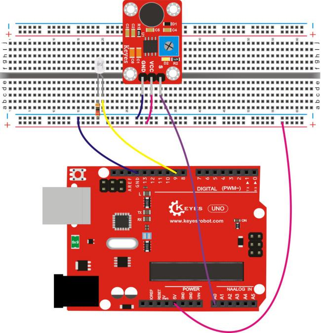

连接Keyes 2560 R3

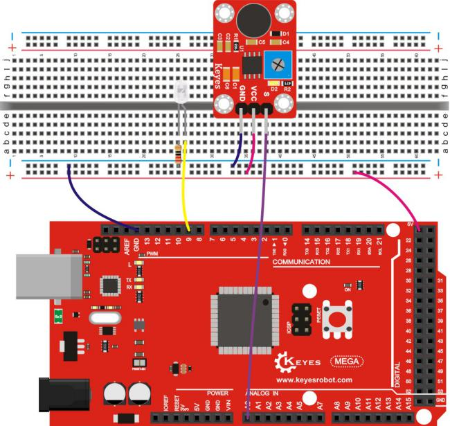

测试代码

```
int MIC=A0;//定义声音传感器为模拟0 接口
int LED=9;//定义LED接口为数字9 接口
int val=0;//定义数字变量
 void setup() 
{
  pinMode(LED,OUTPUT);//定义LED 为输出接口
 pinMode(MIC,INPUT);//定义声音传感器为输入接口
 Serial.begin(9600);//设定波特率为9600 
 } 
void loop() 
{ 
  val=analogRead(MIC);//读取声音传感器的模拟值 
  Serial.println(val);//输出模拟值，并将其打印出来
  if(val>=300)//当模拟值大于300 时LED亮起
  {  
   digitalWrite(LED,HIGH); 
   }else 
   {  
     digitalWrite(LED,LOW); 
    }
   delay(500); 
}

```

测试结果

下载完程序后，我们可以检测声音大小，输出模拟值，声音越大，输出越大。当声音大小到达一定数值时，LED亮起，否则LED熄灭。

## 实验二十七 继电器控灯实验

实验说明

继电器模块是一种用于低电控制高电，保护电路的模块。本实验用到的5V单路继电器模块高电平有效，它有控制指示灯，吸合亮，断开不亮。实验中我们通过控制继电器从而控制一个LED的亮灭。

实验器材

开发板\*1

USB线\*1

5V 单路继电器模块\*1

LED\*1

220Ω 电阻\*1

面包板\*1

面包板连接线若干

杜邦线若干

接线图

连接Keyes UNO R3

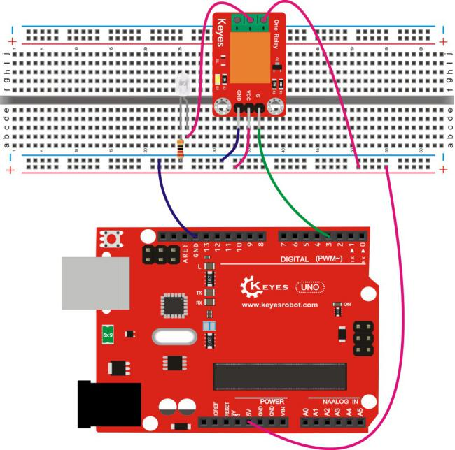

连接Keyes 2560 R3

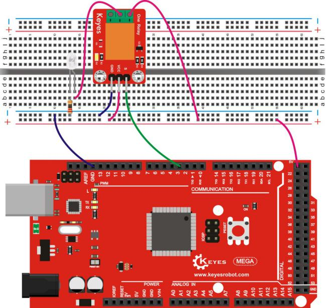

测试代码

```
int Relay = 3; //定义数字口3
void setup()
{
pinMode(Relay, OUTPUT); //将Relay设置为输出
}
void loop()
{
digitalWrite(Relay, HIGH); //打开继电器
delay(2000); //延时2S
digitalWrite(Relay, LOW); //关闭继电器
delay(2000); //延时2S
}
```

测试结果

按照上图接好线，烧录好代码，上电后，继电器开启（ON端和COM端连通）2S，LED

亮起；停止（NC端和COM端连通）2S，LED熄灭；循环交替。开启时继电器上D2灯

亮起。

## 实验二十八 温湿度显示实验

实验说明

前面课程中我们在1602 I2C 蓝屏上显示超声波距离，这一实验程也是将1602 I2C 蓝屏做显示器。这个实验中我们主要用到了DHT11温湿度传感器和1602 I2C
蓝屏。DHT11温湿度传感器是一款含有已校准数字信号输出的温湿度复合传感器，它应用专用的数字模块采集技术和温湿度传感技术，确保产品具有极高的可靠性和卓越的长期稳定性。

实验中我们DHT11温湿度传感器测试出当前环境中的温度和湿度，然后在1602 I2C 蓝屏显示测试结果。

实验器材

开发板\*1

USB线\*1

1602 I2C 蓝屏\*1

DHT11温湿度传感器\*1

面包板\*1

面包板连接线若干

杜邦线若干

接线图

连接Keyes UNO R3

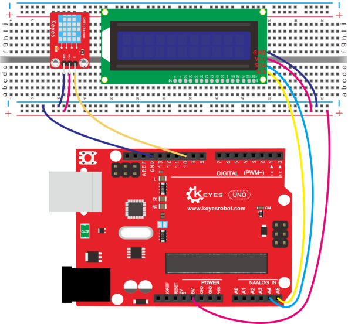

连接Keyes 2560 R3

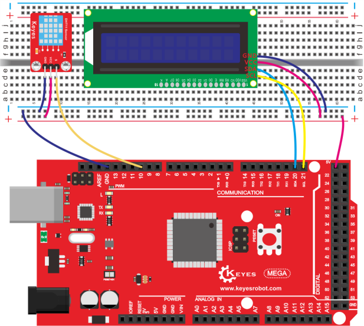

测试代码

```
#include <dht11.h>
#include <Wire.h>         // I2C通信库
#include <LiquidCrystal_I2C.h>  // I2C LCD库

// 初始化LCD对象，参数：I2C地址(0x27)，列数(16)，行数(2)
LiquidCrystal_I2C lcd(0x27, 16, 2);

// 创建DHT11传感器对象
dht11 DHT;

// 定义DHT11数据引脚
#define DHT11_PIN 10   

void setup()
{
    // 初始化LCD
    lcd.init();                      
    
    // 开启LCD背光
    lcd.backlight();
    
    // 设置光标位置(列,行)并打印静态文本
    lcd.setCursor(0, 0);
    lcd.print("Humidity (%):");
    
    lcd.setCursor(0, 1);
    lcd.print("Temp (C):");
}  

void loop()
{
    int chk;
    
    // 读取DHT11传感器数据
    chk = DHT.read(DHT11_PIN);    
    
    // 检查传感器读取状态
    switch (chk)
    {
        case DHTLIB_OK:  // 读取成功
                break;
                
        case DHTLIB_ERROR_CHECKSUM:  // 校验和错误
                break;
                
        case DHTLIB_ERROR_TIMEOUT:  // 超时错误
                break;
                
        default:  // 其他错误
                break;
    }
    
    // 在LCD上显示数据
    lcd.setCursor(13, 0);  // 湿度值显示位置
    lcd.print(DHT.humidity);  // 显示湿度值
    
    lcd.setCursor(9, 1);  // 温度值显示位置
    lcd.print(DHT.temperature);  // 显示温度值
    
    // 延时1秒
    delay(1000);
}
```

测试结果

按照上图接好线，烧录好代码，旋转电位器调节好背光后，1602 I2C
蓝屏显示当前环境中的温度和湿度值。

## 实验二十九 气体检测实验

实验说明

这个实验中我们主要用MQ-2烟雾传感器检测空气中的可燃气体，并将结果显示在1602 I2C
蓝屏上。MQ-2烟雾传感器主要适用于液化气、丙烷和氢气等，它有模拟输出和数字输出两个输出口，它的模拟输出电压随检测环境中气体浓度的升高而增大，具有快速的响应恢复、灵敏度可调、信号有输出指示等特性。

实验器材

开发板\*1

USB线\*1

LED\*1

220Ω 电阻\*1

1602 I2C 蓝屏\*1

MQ-2烟雾传感器\*1

面包板\*1

面包板连接线若干

杜邦线若干

接线图

连接Keyes UNO R3

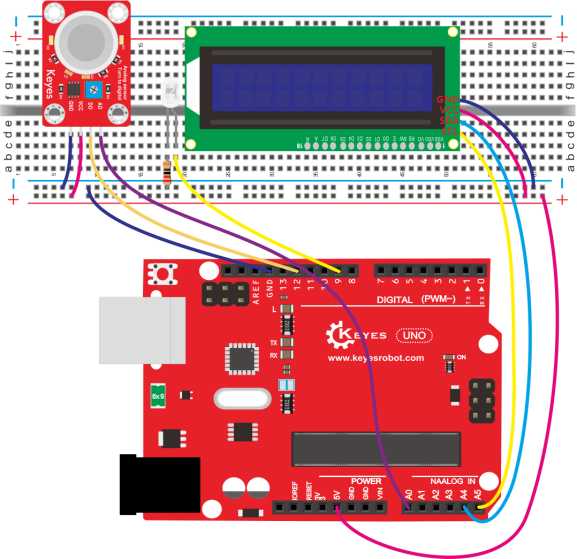

连接Keyes 2560 R3

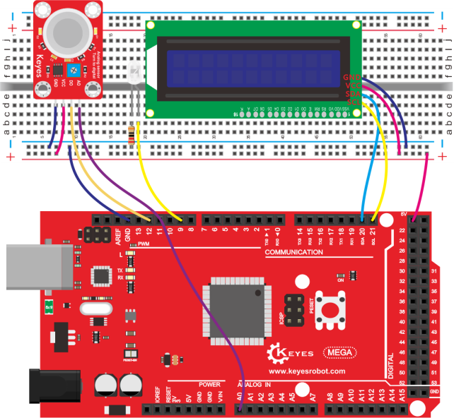

测试代码

```
#include <Wire.h>               // I2C通信库
#include <LiquidCrystal_I2C.h>  // I2C LCD库

// 初始化LCD对象，参数：I2C地址(0x27)，列数(16)，行数(2)
LiquidCrystal_I2C lcd(0x27, 16, 2);

// 引脚定义
int gas_din = 12;  // 气体传感器数字输出引脚
int gas_ain = A0;  // 气体传感器模拟输出引脚
int led = 9;       // LED指示灯引脚
int ad_value;      // 存储模拟读取值

void setup()
{
    // 设置引脚模式
    pinMode(led, OUTPUT);
    pinMode(gas_din, INPUT);
    pinMode(gas_ain, INPUT);
    
    // 初始化LCD
    lcd.init();
    lcd.init();  // 重复初始化(原代码保留)
    
    // 开启LCD背光
    lcd.backlight();
}

void loop()
{
    // 读取气体传感器模拟值
    ad_value = analogRead(gas_ain);
    
    // 检测气体泄漏(数字引脚低电平触发)
    if (digitalRead(gas_din) == LOW)
    {
        // 检测到气体泄漏
        digitalWrite(led, HIGH);  // 点亮LED
        
        // 第一行显示警告信息
        lcd.setCursor(0, 0);
        lcd.print("Gas leakage!    ");
        
        // 第二行显示数值
        lcd.setCursor(0, 1);
        lcd.print("Value:");
        
        // 根据数值位数调整显示位置，保持显示整洁
        if (ad_value < 10)
        {
            lcd.setCursor(6, 1);
            lcd.print(ad_value);
            lcd.setCursor(7, 1);
            lcd.print("         ");  // 清除多余字符
        }
        
        if ((ad_value >= 10) && (ad_value < 100))
        {
            lcd.setCursor(6, 1);
            lcd.print(ad_value);
            lcd.setCursor(8, 1);
            lcd.print("        ");  // 清除多余字符
        }
        
        if (ad_value >= 100)
        {
            lcd.setCursor(6, 1);
            lcd.print(ad_value);
            lcd.setCursor(9, 1);
            lcd.print("       ");  // 清除多余字符
        }
    }
    else
    {
        // 未检测到气体泄漏
        digitalWrite(led, LOW);  // 关闭LED
        
        // 显示安全信息
        lcd.setCursor(0, 0);
        lcd.print("Gas not leak!   ");
        
        lcd.setCursor(0, 1);
        lcd.print("Gas not leak!  ");
    }
    
    // 延时500ms
    delay(500);
}
```

测试结果

下载完程序后，上电后，旋转MQ-2烟雾传感器上的电位器，调节灵敏度，将传感器上的一个LED调节到介于不亮与与亮的临界点，灵敏度最好。旋转1602 I2C 蓝屏上电位器调节LCD背光。当没有检测到可燃气体时，1602 I2C
蓝屏第一行和第二行显示"Gas not leak!
"字符，插件LED不亮；检测到可燃气体时1602 I2C 蓝屏第一行显示"Gas leakage!"字符，第二行显示"Value:"字符和输出的模拟值。

## 实验三十 摇杆模块和电位器控制RGB模块实验

实验说明

RGB色彩模式是工业界的一种颜色标准，是通过对红(R)、绿(G)、蓝(B)三个颜色通道的变化以及它们相互之间的叠加来得到各式各样的颜色的，RGB即是代表红、绿、蓝三个通道的颜色，这个标准几乎包括了人类视力所能感知的所有颜色。

这个实验中我们用一个RGB模块，通过调节摇杆模块和电位器，即可调节RGB灯颜色的变化，并将数据显示在1602 I2C
蓝屏上，即可得到所有颜色的叠加方法。例如，实验中我们将R调节至255，G调节至255，B调节至255，RGB灯显示白色，我们就可以知道以RGB 1：1：1的比例叠加就能得到白色。

实验器材

开发板\*1

USB线\*1

摇杆模块\*1

可调电位器\*1

1602 I2C 蓝屏\*1

keyes 插件RGB模块\*1

面包板\*1

面包板连接线若干

杜邦线若干

接线图

连接Keyes UNO R3

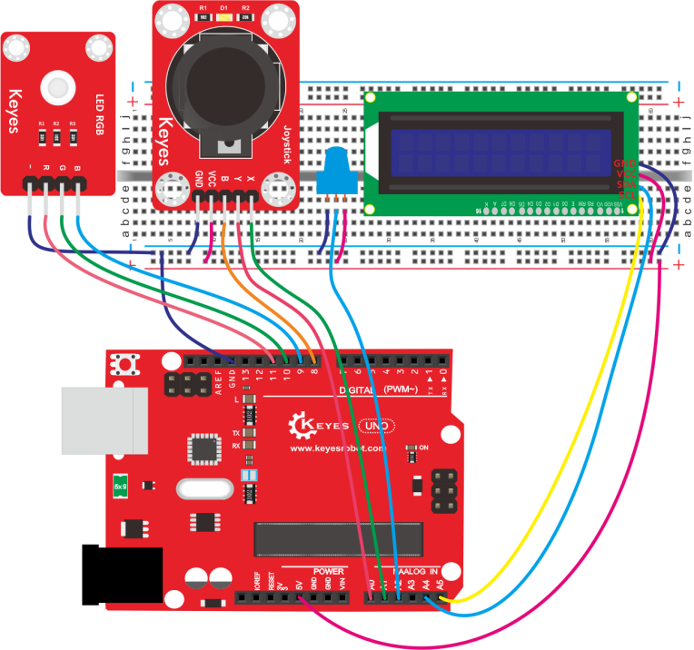

连接Keyes 2560 R3

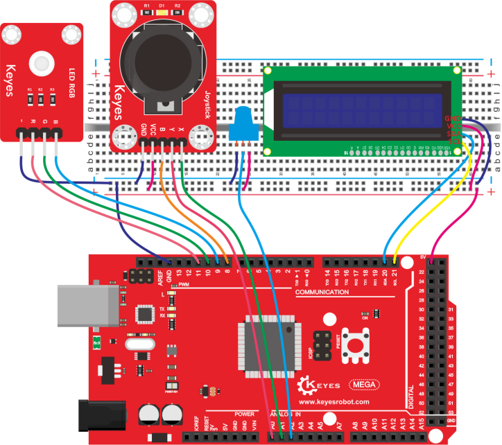

测试代码

```
#include <Wire.h>               // I2C通信库
#include <LiquidCrystal_I2C.h>  // I2C LCD库

// 初始化LCD对象，参数：I2C地址(0x27)，16列2行
LiquidCrystal_I2C lcd(0x27, 16, 2);

// 引脚定义
int redpin = 11;   // 红色LED引脚
int greenpin = 10; // 绿色LED引脚
int bluepin = 9;   // 蓝色LED引脚
int Z = 8;         // 数字输入引脚

// 变量声明
int val;          // 存储数字输入值
int value1;       // 红色通道值
int value2;       // 绿色通道值
int value3;       // 蓝色通道值

void setup() 
{
    // 设置引脚模式
    pinMode(redpin, OUTPUT);
    pinMode(bluepin, OUTPUT);
    pinMode(greenpin, OUTPUT);
    pinMode(Z, INPUT);
    
    // 初始化LCD
    lcd.init();
    lcd.init();  // 重复初始化(保留原代码)
    lcd.backlight();
    
    // 显示静态文本
    lcd.setCursor(0, 0);
    lcd.print("R;");
    lcd.setCursor(8, 0);
    lcd.print("G;");
    lcd.setCursor(0, 1);
    lcd.print("B;");
}

void loop() 
{
    val = digitalRead(Z);  // 读取数字输入
    
    if (val == HIGH)
    {
        // 测试模式：所有LED全亮
        analogWrite(redpin, 255);
        lcd.setCursor(2, 0);
        lcd.print("255");
        
        analogWrite(greenpin, 255);
        lcd.setCursor(10, 0);
        lcd.print("255");
        
        analogWrite(bluepin, 255);
        lcd.setCursor(2, 1);
        lcd.print("255");
    }
    else
    {
        // 正常模式：从模拟输入读取RGB值
        value1 = map(analogRead(0), 0, 1023, 0, 255);  // 红色通道
        value2 = map(analogRead(1), 0, 1023, 0, 255);  // 绿色通道
        value3 = map(analogRead(2), 0, 1023, 0, 255);  // 蓝色通道
        
        // 处理红色通道
        analogWrite(redpin, value1);
        if (value1 < 10)
        {
            lcd.setCursor(2, 0);
            lcd.print(value1);
            lcd.setCursor(3, 0);
            lcd.print("   ");  // 清除多余字符
        }
        if ((value1 >= 10) && (value1 < 100))
        {
            lcd.setCursor(2, 0);
            lcd.print(value1);
            lcd.setCursor(4, 0);
            lcd.print("  ");  // 清除多余字符
        }
        if (value1 >= 100)
        {
            lcd.setCursor(2, 0);
            lcd.print(value1);
        }
        delay(100);
        
        // 处理绿色通道
        analogWrite(greenpin, value2);
        if (value2 < 10)
        {
            lcd.setCursor(10, 0);
            lcd.print(value2);
            lcd.setCursor(11, 0);
            lcd.print("   ");  // 清除多余字符
        }
        if ((value2 >= 10) && (value2 < 100))
        {
            lcd.setCursor(10, 0);
            lcd.print(value2);
            lcd.setCursor(12, 0);
            lcd.print("  ");  // 清除多余字符
        }
        if (value2 >= 100)
        {
            lcd.setCursor(10, 0);
            lcd.print(value2);
        }
        delay(100);
        
        // 处理蓝色通道
        analogWrite(bluepin, value3);
        if (value3 < 10)
        {
            lcd.setCursor(2, 1);
            lcd.print(value3);
            lcd.setCursor(3, 1);
            lcd.print("   ");  // 清除多余字符
        }
        if ((value3 >= 10) && (value3 < 100))
        {
            lcd.setCursor(2, 1);
            lcd.print(value3);
            lcd.setCursor(4, 1);
            lcd.print("  ");  // 清除多余字符
        }
        if (value3 >= 100)
        {
            lcd.setCursor(2, 1);
            lcd.print(value3);
        }
        delay(100);
    }
}
```


测试结果

下载完程序后，上电后，按下摇杆模块Z方向时，RGB灯显示白色，1602 I2C
蓝屏上

显示的RGB数值都为255。松开摇杆模块Z方向时，调节摇杆模块和电位器，RGB灯

显示不同颜色，并且可以在1602 I2C 蓝屏看到对应数值。

## 实验三十一 TMD27713 距离传感器实验

实验说明

keyes TMD27713
距离传感器是环境光+接近传感器+红外LED三合一传感器，它主要有两方面的功用，一方面用于来侦测当前环境光亮度（ALS）；并且采用软件调节的方式按照当前环境光亮度状况自动调节背光亮度以适应环境亮度；使背光亮度柔和起到保护视力的作用同时可以达到节电的效果；另一功能我们称为接近传感功能（PROX）。

本实验只是简单的测试下这个传感器的基本功能。

实验器材

开发板\*1

USB线\*1

keyes TMD27713 距离传感器\*1

杜邦线若干

接线图

连接Keyes UNO R3

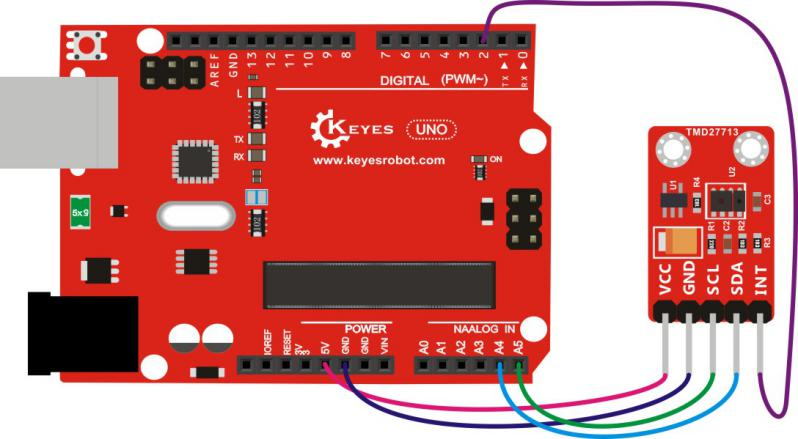

连接Keyes 2560 R3

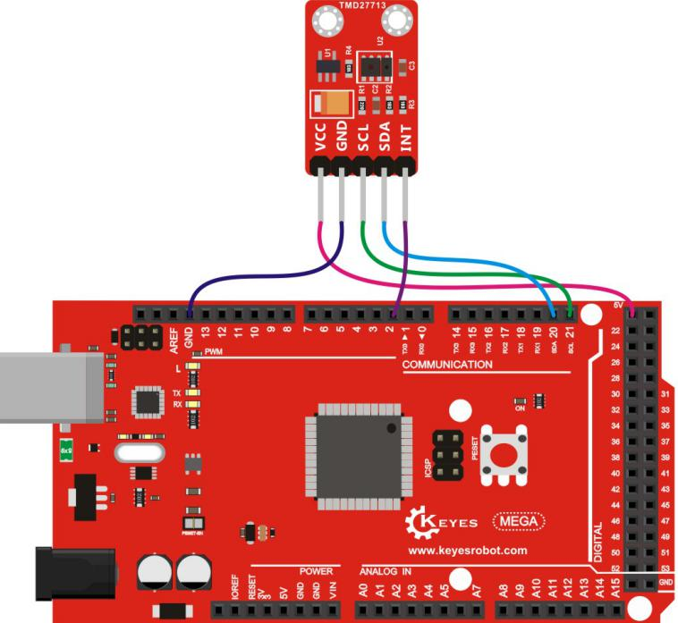

测试代码

```
#define DUMP_REGS

#include <Wire.h>
#include <APDS9930.h>

// 引脚定义
#define APDS9930_INT    2  // 需要使用中断引脚
#define LED_PIN         13 // 用于显示中断的LED引脚

// 常量定义
#define PROX_INT_HIGH   600 // 触发中断的接近阈值
#define PROX_INT_LOW    0   // 无远距离中断

// 全局变量
APDS9930 apds = APDS9930();
float ambient_light = 0;   // 环境光强度，也可定义为unsigned long
uint16_t ch0 = 0;          // 通道0光强度
uint16_t ch1 = 1;          // 通道1光强度
uint16_t proximity_data = 0; // 接近数据
volatile bool isr_flag = false; // 中断标志位

void setup() 
{
    // 设置LED为输出模式
    pinMode(LED_PIN, OUTPUT);
    pinMode(APDS9930_INT, INPUT);

    // 初始化串口
    Serial.begin(9600);
    Serial.println();
    Serial.println(F("------------------------------"));
    Serial.println(F("APDS-9930 - ProximityInterrupt"));
    Serial.println(F("------------------------------"));

    // 初始化中断服务例程
    attachInterrupt(digitalPinToInterrupt(APDS9930_INT), interruptRoutine, FALLING);

    // 初始化APDS-9930（配置I2C和初始值）
    if (apds.init()) 
    {
        Serial.println(F("APDS-9930 initialization complete"));
    }
    else 
    {
        Serial.println(F("Something went wrong during APDS-9930 init!"));
    }

    // 调整接近传感器增益
    if (!apds.setProximityGain(PGAIN_2X)) 
    {
        Serial.println(F("Something went wrong trying to set PGAIN"));
    }

    // 设置接近中断阈值
    if (!apds.setProximityIntLowThreshold(PROX_INT_LOW)) 
    {
        Serial.println(F("Error writing low threshold"));
    }
    if (!apds.setProximityIntHighThreshold(PROX_INT_HIGH)) 
    {
        Serial.println(F("Error writing high threshold"));
    }

    // 启动APDS-9930接近传感器（带中断）
    if (apds.enableProximitySensor(true)) 
    {
        Serial.println(F("Proximity sensor is now running"));
    }
    else 
    {
        Serial.println(F("Something went wrong during sensor init!"));
    }

    // 启动APDS-9930光传感器（不带中断）
    if (apds.enableLightSensor(false)) 
    {
        Serial.println(F("Light sensor is now running"));
    }
    else 
    {
        Serial.println(F("Something went wrong during light sensor init!"));
    }

#ifdef DUMP_REGS
    // 寄存器转储
    uint8_t reg;
    uint8_t val;

    for (reg = 0x00; reg <= 0x19; reg++) 
    {
        if ((reg != 0x10) && (reg != 0x11))
        {
            apds.wireReadDataByte(reg, val);
            Serial.print(reg, HEX);
            Serial.print(": 0x");
            Serial.println(val, HEX);
        }
    }
    apds.wireReadDataByte(0x1E, val);
    Serial.print(0x1E, HEX);
    Serial.print(": 0x");
    Serial.println(val, HEX);
#endif
}

void loop() 
{
    // 如果中断发生，打印接近等级
    if (isr_flag) 
    {
        // 读取接近等级并打印
        if (!apds.readProximity(proximity_data)) 
        {
            Serial.println("Error reading proximity value");
        }
        else 
        {
            Serial.print("Proximity detected! Level: ");
            Serial.print(proximity_data);
            Serial.print("   ");
        }
        
        apds.readAmbientLightLux(ambient_light);
        
        // 读取光强度（环境光、通道0、通道1）
        if (!apds.readAmbientLightLux(ambient_light) ||
            !apds.readCh0Light(ch0) ||
            !apds.readCh1Light(ch1)) 
        {
            Serial.println(F("Error reading light values"));
        }
        else 
        {
            Serial.print(F("Ambient: "));
            Serial.print(ambient_light);
            Serial.print(F("  Ch0: "));
            Serial.print(ch0);
            Serial.print(F("  Ch1: "));
            Serial.println(ch1);
        }

        // LED亮起0.3秒
        digitalWrite(LED_PIN, HIGH);
        delay(300);
        digitalWrite(LED_PIN, LOW);

        // 重置标志位并清除APDS-9930中断（重要！）
        isr_flag = false;
        if (!apds.clearProximityInt()) 
        {
            Serial.println("Error clearing interrupt");
        }
    }
}

void interruptRoutine() 
{
    isr_flag = true;
}
```

测试结果

测试时需用arduino-1.8.2版本软件测试，下载完程序后，上电后，打开串口监视器，显

示如下图。


## 实验三十二 加速度传感器实验

实验说明

MMA8452Q 是一款具有
12位分辨率的智能低功耗、三轴、电容式微机械加速度传感器。这款加速度传感器具有丰富嵌入式功能，带有灵活的用户可编程选项，可以配置多达两个中断引脚。嵌入式中断功能可以节省整体功耗，解除主处理器不断轮询数据的负担。MMA8452Q
具有±2g/±4g/±8g的用户可选量程，可以实时输出高通滤波数据和非滤波数据。该器件可被配置成利用任意组合可配置嵌入式的功能生成惯性唤醒中断信号，这就使MMA8452Q
在监控事件同时，在静止状态保持低功耗模式。

本实验只是利用keyes MMA8452Q
三轴数字加速度传感器测试下物体的三轴加速度。

实验器材

开发板\*1

USB线\*1

keyes MMA8452Q 三轴数字加速度传感器\*1

杜邦线若干

接线图

连接Keyes UNO R3

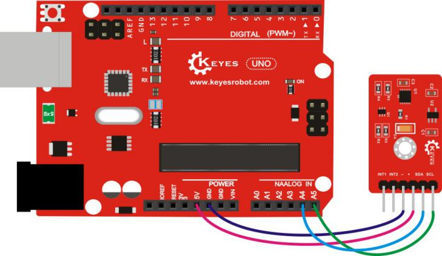

连接Keyes 2560 R3

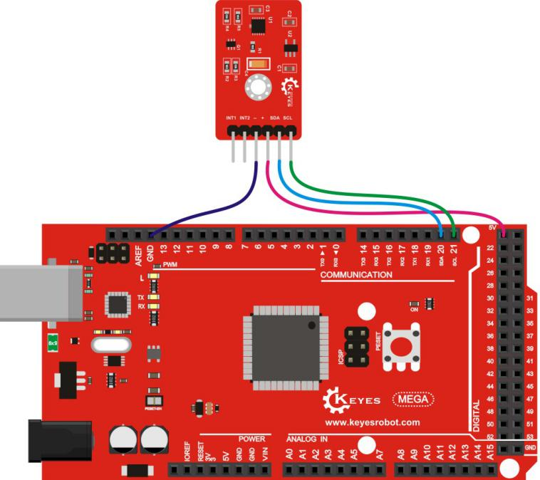

测试代码

```
#include <Wire.h>          // 必须包含Wire库以支持I2C通信
#include <SparkFun_MMA8452Q.h> // 包含SFE_MMA8452Q加速度计库

// 创建MMA8452Q类的实例，命名为"accel"，后续将通过此实例操作传感器
MMA8452Q accel;

// 初始化函数，启动串口并初始化加速度计
void setup() 
{
    Serial.begin(9600);    // 初始化串口通信，波特率9600
    Serial.println("MMA8452Q Test Code!"); // 打印测试信息
  
    // 初始化加速度计有以下几种选项：
    // 1. 默认初始化：设置量程为±2g，输出数据速率为800Hz（最快）
    accel.init();
    // 2. 自定义量程初始化：可选SCALE_2G、SCALE_4G或SCALE_8G
    //accel.init(SCALE_4G); // 取消注释以使用±4g量程
    // 3. 自定义量程和数据速率初始化：第二参数可选ODR_800、ODR_400等
    //accel.init(SCALE_8G, ODR_6); // 取消注释以使用±8g量程和6.25Hz速率
}

// 主循环函数，检测加速度计数据并打印
void loop() 
{
    // 使用accel.available()等待新数据
    if (accel.available()) 
    {
        // 读取新数据
        accel.read();
    
        // accel.read()会更新两组变量：
        // * x/y/z：存储12位有符号原始数据
        // * cx/cy/cz：存储计算后的加速度值（单位：g）
        printCalculatedAccels(); // 打印计算后的加速度值
        //printAccels();         // 取消注释以打印原始数字读数
    
        // 打印传感器方向状态（横屏/竖屏检测）
        printOrientation();
    
        Serial.println();       // 每次循环后换行
    }
}

// 打印原始12位数字读数（x/y/z变量）
// 注意：调用前必须先执行accel.read()
void printAccels() 
{
    Serial.print(accel.x, 3);  // 打印X轴原始值，保留3位小数
    Serial.print("\t");        // 制表符分隔
    Serial.print(accel.y, 3);  // 打印Y轴原始值
    Serial.print("\t");
    Serial.print(accel.z, 3);  // 打印Z轴原始值
    Serial.print("\t");
}

// 打印计算后的加速度值（cx/cy/cz变量，单位g）
// 注意：调用前必须先执行accel.read()
void printCalculatedAccels() 
{ 
    Serial.print(accel.cx, 3); // 打印X轴加速度值
    Serial.print("\t");
    Serial.print(accel.cy, 3); // 打印Y轴加速度值
    Serial.print("\t");
    Serial.print(accel.cz, 3); // 打印Z轴加速度值
    Serial.print("\t");
}

// 打印传感器方向状态（横屏/竖屏检测）
void printOrientation() 
{
    // accel.readPL()返回方向状态字节
    byte pl = accel.readPL();
    switch (pl) 
    {
    case PORTRAIT_U:          // 纵向-正向
        Serial.print("Portrait Up");
        break;
    case PORTRAIT_D:          // 纵向-倒置
        Serial.print("Portrait Down");
        break;
    case LANDSCAPE_R:         // 横向-右侧
        Serial.print("Landscape Right");
        break;
    case LANDSCAPE_L:         // 横向-左侧
        Serial.print("Landscape Left");
        break;
    case LOCKOUT:             // 水平放置
        Serial.print("Flat");
        break;
    }
}
```


测试结果

下载完程序后，上电后，打开串口监视器，移动传感器值，有数值变化，显示如下图。

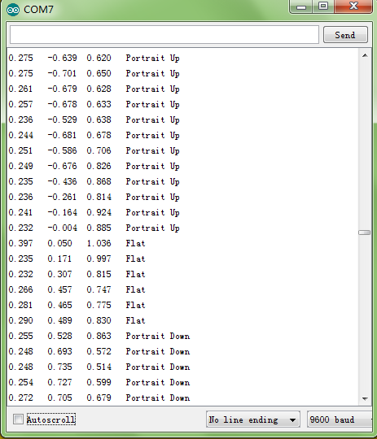

## 实验三十三 太阳光紫外线传感器实验

实验说明

Keyes GUVA-S12SD 3528
太阳光紫外线传感器是一款测试紫外线的传感器，它包含GUVA-S12SD，可以广泛用于智能穿戴设备的紫外线指数检测，如带UV指数检测功能的手表，带UV指数检测的智能手机，户外检测UV指数设备等，还可以用于紫外线消毒时，用来监测紫外线强度、UV火焰探测器等。

本实验只是利用紫外线传感器检测下当前环境中的紫外线，将结果在1602 LCD上显示。

实验器材

开发板\*1

USB线\*1

LED\*1

220Ω 电阻\*1

1602 I2C 蓝屏\*1

GUVA-S12SD 3528 太阳光紫外线传感器\*1

面包板\*1

面包板连接线若干

杜邦线若干

接线图

连接Keyes UNO R3

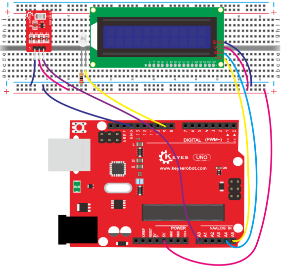

连接Keyes 2560 R3

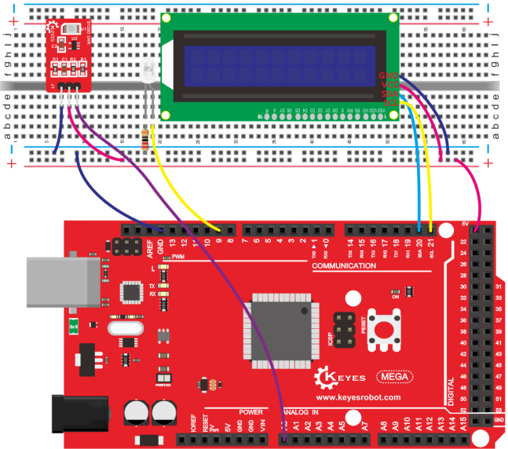

测试代码

```
#include <Wire.h>                   // 包含I2C通信库
#include <LiquidCrystal_I2C.h>      // 包含I2C LCD库

// 初始化LCD对象，参数：I2C地址(0x27)，列数(16)，行数(2)
LiquidCrystal_I2C lcd(0x27, 16, 2); 

int led = 9;                       // LED连接引脚9

void setup() 
{
    pinMode(led, OUTPUT);           // 设置LED引脚为输出模式
  
    lcd.init();                     // 初始化LCD
    lcd.init();                     // 重复初始化确保可靠性
  
    lcd.backlight();                // 开启LCD背光
  
    // 在LCD上显示初始信息
    lcd.setCursor(0, 0);            // 设置光标位置(列,行)
    lcd.print("Ultra-Violet ");     // 打印第一行文本
  
    lcd.setCursor(0, 1);            // 移动到第二行
    lcd.print("Detection:");        // 打印第二行文本
}

void loop() 
{ 
    int sensorValue = analogRead(A0); // 读取A0引脚的模拟值（紫外线传感器值）
  
    // 根据传感器值范围进行不同处理
    if (sensorValue < 10) 
    {
        lcd.setCursor(10, 1);        // 设置数值显示位置
        lcd.print(sensorValue);      // 打印传感器值
        lcd.setCursor(11, 1);        // 清除多余字符的位置
        lcd.print("     ");          // 用空格清除多余字符
        digitalWrite(led, LOW);     // 关闭LED
    }
  
    if ((sensorValue >= 10) && (sensorValue < 100)) 
    {
        lcd.setCursor(10, 1);        // 设置数值显示位置
        lcd.print(sensorValue);      // 打印传感器值
        lcd.setCursor(12, 1);        // 清除多余字符的位置
        lcd.print("    ");           // 用空格清除多余字符
        digitalWrite(led, HIGH);    // 点亮LED
    }
  
    if (sensorValue >= 100) 
    {
        lcd.setCursor(10, 1);        // 设置数值显示位置
        lcd.print(sensorValue);      // 打印传感器值
        lcd.setCursor(13, 1);        // 清除多余字符的位置
        lcd.print("   ");            // 用空格清除多余字符
        digitalWrite(led, HIGH);     // 点亮LED
    }
  
    delay(500);                     // 延迟500毫秒
}
```


