# 清单

|编码|名称|描述|数量|图片|
|-|-|-|-|-|
| 1 | LED | F5-白发红-短 | 5 |  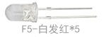  |
| 2 | LED | F5-白发黄-短 | 5 |  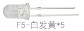  |
| 3 | LED | F5-白发蓝-短 | 5 |  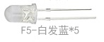  |
| 4 | 电阻 | 碳膜色环 1/4W 1% 220R 编带 | 8 |    |
| 5 | 电阻 | 碳膜色环 1/4W 1% 1K 编带 | 5 |    |
| 6 | 电阻 | 碳膜色环 1/4W 1% 10K 编带 | 5 |    |
| 7 | 点阵 | 20*20MM 1.9MM红色 共阳 | 1 |  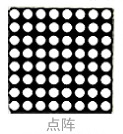  |
| 8 | 数码管 | 一位0.56英寸共阴红 | 1 |  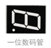  |
| 9 | 数码管 | 四位0.36英寸共阴红 3461AH | 1 |  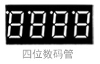  |
| 10 | IC | 74HC595 DIP | 1 |  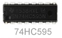  |
| 11 | 可调电位器 |  MU 103 （三针直排）  | 1 |  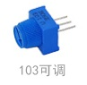  |
| 12 | 蜂鸣器 | 无源 12*8.5MM 5V 普通分体 2K | 1 |  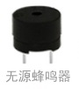  |
| 13 | 蜂鸣器 | 有源 12*9.5MM 5V 普通分体 2300Hz | 1 |  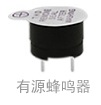  |
| 14 | 轻触按键 | 12*12*7.3MM 插件 | 4 |  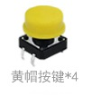  |
| 15 | 按键帽 | A24 黄帽(12*12*7.3)圆 | 4 |    |
| 16 | 传感器元件 | LM35DZ | 1 |  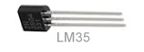  |
| 17 | 传感器元件 | 5MM 光敏电阻 | 3 |  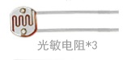  |
| 18 | 传感器元件 | 红外接收 5MM 火焰 | 1 |  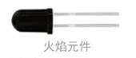  |
| 19 | 传感器元件 | 红外接收 VS1838B | 1 |  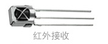  |
| 20 | 滚珠开关 | HDX-2801 两脚一样 | 2 |  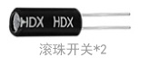  |
| 21 | 模块 | 1602 I2C 蓝屏 | 1 |    |
| 22 | 模块 | 4*4薄膜键盘 | 1 |    |
| 23 | 面包板 | ZY-102 830孔 白色 （纸卡包装） | 1 |    |
| 24 | 模块 | 5V步进电机 | 1 |    |
| 25 | USB线 | AM/BM 透明蓝 OD:5.0 L=50cm | 1 |    |
| 26 | 遥控器 | JMP-1 17键86*40*6.5MM 黑色 | 1 |    |
| 27 | 面包线 | 面包板连接线65根 | 1 |  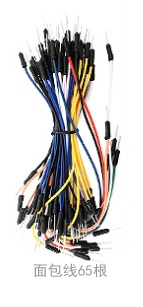  |
| 28 | 杜邦线 | 公对母20CM/40P/2.54/10股铜包铝 24号线BL | 0.5 |    |
| 29 | 舵机 | SG90 9G 23*12.2*29mm 蓝色 辉盛(环保） | 1 |    |
| 30 | 电池扣 | 优质型 9V电池扣 实验电源连接线 | 1 |    |
| 31 | IC卡 | 白卡 85.5*54*0.80MM | 1 |    |
| 32 | 钥匙扣 | TAG-03 41*33*403mm ABS蓝色 | 1 |    |
| 33 | keyes模块 | Keyes RFID－RC522 射频模块 （焊盘孔） 红色 环保 | 1 |    |
| 34 | keyes传感器 | keyes 麦克风声音传感器(焊盘孔) 红色 环保 | 1 |    |
| 35 | keyes传感器 | keyes 超声波传感器 | 1 |    |
| 36 | keyes模块 | keyes 插件RGB模块(焊盘孔) 红色 环保 | 1 |    |
| 37 | keyes模块 | keyes 5V 单路继电器模块(焊盘孔) 红色 环保 | 1 |    |
| 38 | keyes传感器 | keyes DHT11温湿度传感器(焊盘孔) 红色 环保 | 1 |    |
| 39 | Keyes模块 | keyes 1302时钟模块(焊盘孔) 红色 环保 | 1 |    |
| 40 | keyes传感器 | keyes 人体红外热释电传感器(焊盘孔) 红色 环保 | 1 |    |
| 41 | keyes驱动板 | Keyes ULN2003步进电机驱动板（焊盘孔） 红色 环保 | 1 |    |
| 42 | keyes传感器 | keyes MQ-2 烟雾传感器(焊盘孔) 红色 环保 | 1 |    |
| 43 | keyes传感器 | keyes 摇杆模块传感器(焊盘孔) 红色 环保 | 1 |    |
| 44 | 传感器模块 | keyes TMD27713 距离传感器 | 1 |  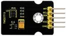  |
| 45 | 传感器模块 | keyes MMA8452Q 三轴数字加速度传感器 | 1 |    |
| 46 | 传感器模块 | keyes GUVA-S12SD 3528 太阳光紫外线传感器 | 1 |  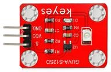  |
| 47 | 电阻卡 | 100*70MM | 1 |    |
| 48 | 开发板 | Keyes UNO R3 开发板 for arduino 红色 环保 | 1 |    |
| 48 | 开发板 | Keyes 2560 R3 开发板 for arduino 红色 环保 | 1 |    |

