清单
====

.. container:: table-wrapper

   +------+-------------+---------------------+------+-----------+
   | 编码 | 名称        | 描述                | 数量 | 图片      |
   +======+=============+=====================+======+===========+
   | 1    | LED         | F5-白发红-短        | 5    | |image99| |
   +------+-------------+---------------------+------+-----------+
   | 2    | LED         | F5-白发黄-短        | 5    | |image100||
   +------+-------------+---------------------+------+-----------+
   | 3    | LED         | F5-白发蓝-短        | 5    | |image101| |
   +------+-------------+---------------------+------+-----------+
   | 4    | 电阻        | 碳膜色环 1/4W 1%    | 8    | |image102||
   |      |             | 220R 编带           |      |          |
   +------+-------------+---------------------+------+-----------+
   | 5    | 电阻        | 碳膜色环 1/4W 1% 1K | 5    | |         |
   |      |             | 编带                |      | image103| |
   +------+-------------+---------------------+------+-----------+
   | 6    | 电阻        | 碳膜色环 1/4W 1%    | 5    | |         |
   |      |             | 10K 编带            |      | image104| |
   +------+-------------+---------------------+------+-----------+
   | 7    | 点阵        | 20*20MM 1.9MM红色   | 1    | |         |
   |      |             | 共阳                |      | image105| |
   +------+-------------+---------------------+------+-----------+
   | 8    | 数码管      | 一位0.56英寸共阴红  | 1    | |         |
   |      |             |                     |      | image106| |
   +------+-------------+---------------------+------+-----------+
   | 9    | 数码管      | 四位0.36英寸共阴红  | 1    | |         |
   |      |             | 3461AH              |      | image107| |
   +------+-------------+---------------------+------+-----------+
   | 10   | IC          | 74HC595 DIP         | 1    | |         |
   |      |             |                     |      | image108| |
   +------+-------------+---------------------+------+-----------+
   | 11   | 可调电位器  | MU 103 （三针直排） | 1    | |         |
   |      |             |                     |      | image109| |
   +------+-------------+---------------------+------+-----------+
   | 12   | 蜂鸣器      | 无源 12*8.5MM 5V    | 1    | |         |
   |      |             | 普通分体 2K         |      | image110| |
   +------+-------------+---------------------+------+-----------+
   | 13   | 蜂鸣器      | 有源 12*9.5MM 5V    | 1    | |         |
   |      |             | 普通分体 2300Hz     |      | image111| |
   +------+-------------+---------------------+------+-----------+
   | 14   | 轻触按键    | 12\ *12*\ 7.3MM     | 4    | |         |
   |      |             | 插件                |      | image112| |
   +------+-------------+---------------------+------+-----------+
   | 15   | 按键帽      | A24                 | 4    | |         |
   |      |             | 黄                  |      | image113| |
   |      |             | 帽(12\ *12*\ 7.3)圆 |      |           |
   +------+-------------+---------------------+------+-----------+
   | 16   | 传感器元件  | LM35DZ              | 1    | |         |
   |      |             |                     |      | image114| |
   +------+-------------+---------------------+------+-----------+
   | 17   | 传感器元件  | 5MM 光敏电阻        | 3    | |         |
   |      |             |                     |      | image115| |
   +------+-------------+---------------------+------+-----------+
   | 18   | 传感器元件  | 红外接收 5MM 火焰   | 1    | |         |
   |      |             |                     |      | image116| |
   +------+-------------+---------------------+------+-----------+
   | 19   | 传感器元件  | 红外接收 VS1838B    | 1    | |         |
   |      |             |                     |      | image117| |
   +------+-------------+---------------------+------+-----------+
   | 20   | 滚珠开关    | HDX-2801 两脚一样   | 2    | |         |
   |      |             |                     |      | image118| |
   +------+-------------+---------------------+------+-----------+
   | 21   | 模块        | 1602 I2C 蓝屏       | 1    | |         |
   |      |             |                     |      | image119| |
   +------+-------------+---------------------+------+-----------+
   | 22   | 模块        | 4*4薄膜键盘         | 1    | |         |
   |      |             |                     |      | image120| |
   +------+-------------+---------------------+------+-----------+
   | 23   | 面包板      | ZY-102 830孔 白色   | 1    | |         |
   |      |             | （纸卡包装）        |      | image121| |
   +------+-------------+---------------------+------+-----------+
   | 24   | 模块        | 5V步进电机          | 1    | |         |
   |      |             |                     |      | image122| |
   +------+-------------+---------------------+------+-----------+
   | 25   | USB线       | AM/BM 透明蓝 OD:5.0 | 1    | |         |
   |      |             | L=50cm              |      | image123| |
   +------+-------------+---------------------+------+-----------+
   | 26   | 遥控器      | JMP-1               | 1    | |         |
   |      |             | 17键86\ *40*\ 6.5MM |      | image124| |
   |      |             | 黑色                |      |           |
   +------+-------------+---------------------+------+-----------+
   | 27   | 面包线      | 面包板连接线65根    | 1    | |         |
   |      |             |                     |      | image125| |
   +------+-------------+---------------------+------+-----------+
   | 28   | 杜邦线      | 公对母20CM/         | 0.5  | |         |
   |      |             | 40P/2.54/10股铜包铝 |      | image126| |
   |      |             | 24号线BL            |      |           |
   +------+-------------+---------------------+------+-----------+
   | 29   | 舵机        | SG90 9G             | 1    | |         |
   |      |             | 23\ *12.2*\ 29mm    |      | image127| |
   |      |             | 蓝色 辉盛(环保）    |      |           |
   +------+-------------+---------------------+------+-----------+
   | 30   | 电池扣      | 优质型 9V电池扣     | 1    | |         |
   |      |             | 实验电源连接线      |      | image128| |
   +------+-------------+---------------------+------+-----------+
   | 31   | IC卡        | 白卡                | 1    | |         |
   |      |             | 85.5\ *54*\ 0.80MM  |      | image129| |
   +------+-------------+---------------------+------+-----------+
   | 32   | 钥匙扣      | TAG-03              | 1    | |         |
   |      |             | 41\ *33*\ 403mm     |      | image130| |
   |      |             | ABS蓝色             |      |           |
   +------+-------------+---------------------+------+-----------+
   | 33   | keyes模块   | Keyes RFID－RC522   | 1    | |         |
   |      |             | 射频模块 （焊盘孔） |      | image131| |
   |      |             | 红色 环保           |      |           |
   +------+-------------+---------------------+------+-----------+
   | 34   | keyes传感器 | keyes               | 1    | |         |
   |      |             | 麦克风              |      | image132| |
   |      |             | 声音传感器(焊盘孔)  |      |           |
   |      |             | 红色 环保           |      |           |
   +------+-------------+---------------------+------+-----------+
   | 35   | keyes传感器 | keyes 超声波传感器  | 1    | |         |
   |      |             |                     |      | image133| |
   +------+-------------+---------------------+------+-----------+
   | 36   | keyes模块   | keyes               | 1    | |         |
   |      |             | 插件RGB模块(焊盘孔) |      | image134| |
   |      |             | 红色 环保           |      |           |
   +------+-------------+---------------------+------+-----------+
   | 37   | keyes模块   | keyes 5V            | 1    | |         |
   |      |             | 单路                |      | image135| |
   |      |             | 继电器模块(焊盘孔)  |      |           |
   |      |             | 红色 环保           |      |           |
   +------+-------------+---------------------+------+-----------+
   | 38   | keyes传感器 | keyes               | 1    | |         |
   |      |             | DHT11温             |      | image136| |
   |      |             | 湿度传感器(焊盘孔)  |      |           |
   |      |             | 红色 环保           |      |           |
   +------+-------------+---------------------+------+-----------+
   | 39   | Keyes模块   | keyes               | 1    | |         |
   |      |             | 1                   |      | image137| |
   |      |             | 302时钟模块(焊盘孔) |      |           |
   |      |             | 红色 环保           |      |           |
   +------+-------------+---------------------+------+-----------+
   | 40   | keyes传感器 | keyes               | 1    | |         |
   |      |             | 人体红外热          |      | image138| |
   |      |             | 释电传感器(焊盘孔)  |      |           |
   |      |             | 红色 环保           |      |           |
   +------+-------------+---------------------+------+-----------+
   | 41   | keyes驱动板 | Keyes               | 1    | |         |
   |      |             | ULN2003步进电       |      | image139| |
   |      |             | 机驱动板（焊盘孔）  |      |           |
   |      |             | 红色 环保           |      |           |
   +------+-------------+---------------------+------+-----------+
   | 42   | keyes传感器 | keyes MQ-2          | 1    | |         |
   |      |             | 烟雾传感器(焊盘孔)  |      | image140| |
   |      |             | 红色 环保           |      |           |
   +------+-------------+---------------------+------+-----------+
   | 43   | keyes传感器 | keyes               | 1    | |         |
   |      |             | 摇杆                |      | image141| |
   |      |             | 模块传感器(焊盘孔)  |      |           |
   |      |             | 红色 环保           |      |           |
   +------+-------------+---------------------+------+-----------+
   | 44   | 传感器模块  | keyes TMD27713      | 1    | |         |
   |      |             | 距离传感器          |      | image142| |
   +------+-------------+---------------------+------+-----------+
   | 45   | 传感器模块  | keyes MMA8452Q      | 1    | |         |
   |      |             | 三                  |      | image143| |
   |      |             | 轴数字加速度传感器  |      |           |
   +------+-------------+---------------------+------+-----------+
   | 46   | 传感器模块  | keyes GUVA-S12SD    | 1    | |         |
   |      |             | 3528                |      | image144| |
   |      |             | 太阳光紫外线传感器  |      |           |
   +------+-------------+---------------------+------+-----------+
   | 47   | 电阻卡      | 100*70MM            | 1    | |         |
   |      |             |                     |      | image145| |
   +------+-------------+---------------------+------+-----------+
   | 48   | 开发板      | Keyes UNO R3 开发板 | 1    | |         |
   |      |             | for arduino 红色    |      | image146| |
   |      |             | 环保                |      |           |
   +------+-------------+---------------------+------+-----------+
   | 48   | 开发板      | Keyes 2560 R3       | 1    | |         |
   |      |             | 开发板 for arduino  |      | image147| |
   |      |             | 红色 环保           |      |           |
   +------+-------------+---------------------+------+-----------+

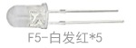
.. |image2| image:: media/F5-baifahuang-duan.jpeg
.. |image3| image:: media/F5-baifalan-duan.jpeg
.. |image4| image:: media/4cda5da2c77a5e8f9ee14e21ce171b18.png
.. |image5| image:: media/e595e9dbbd22e6f72867ed8853f21600.png
.. |image6| image:: media/af39238525c3e329c1f7d6f1937c2676.png
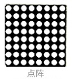
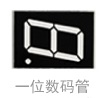
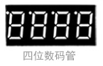
.. |image10| image:: media/74HC595DIP.jpeg
.. |image11| image:: media/dianweiqi.jpeg
.. |image12| image:: media/wuyuanfengmingqi.jpeg
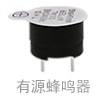
.. |image14| image:: media/anjian.jpeg
.. |image15| image:: media/anjian.jpeg
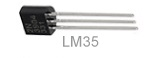
.. |image17| image:: media/guangmindianzu.jpeg
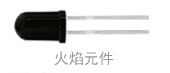
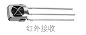
.. |image20| image:: media/gunzhukaiguan.jpeg
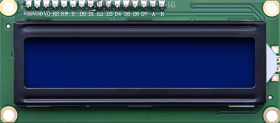
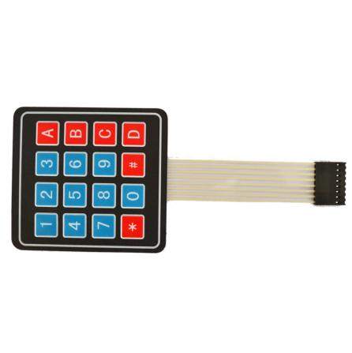
.. |image23| image:: media/014fcb7b8de94392fe7e676522bc663a.jpeg
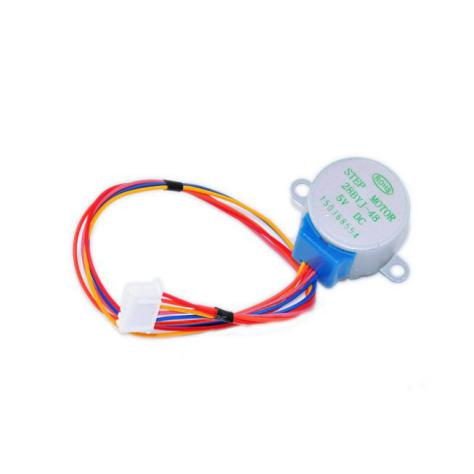
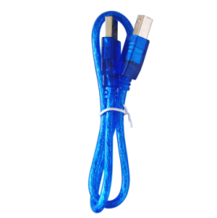
.. |image26| image:: media/c6a4a156298845be8ba0e1f99b01a3c0.jpeg
.. |image27| image:: media/mianbaoxian65.jpeg
.. |image28| image:: media/eb8b3c665dbdae05c80ebac77f9f363c.jpeg
.. |image29| image:: media/92c0c7ace837104963517c3ec5db750d.jpeg
.. |image30| image:: media/da4fd3d4d648c07705dec1dbfb66bcaa.jpeg

.. |image32| image:: media/13c7cbac439470bcc6ab22ce1410ce24.jpeg
.. |image33| image:: media/2eb75448fd3850cfb39a695429d2431f.jpeg
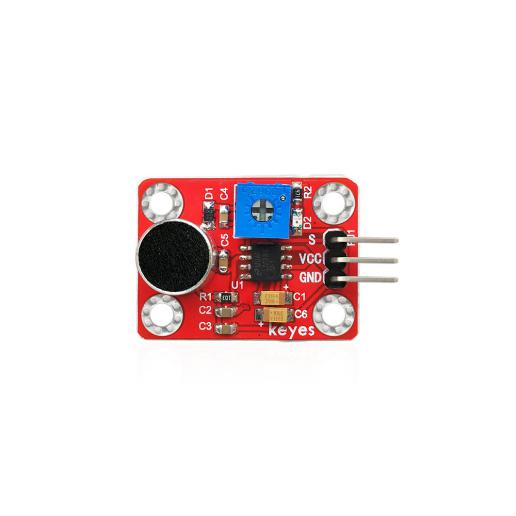
.. |image35| image:: media/9fc0922e2784373238dc169388be6d5b.jpeg
.. |image36| image:: media/5974416b9ece25307371064c01e0e98f.jpeg
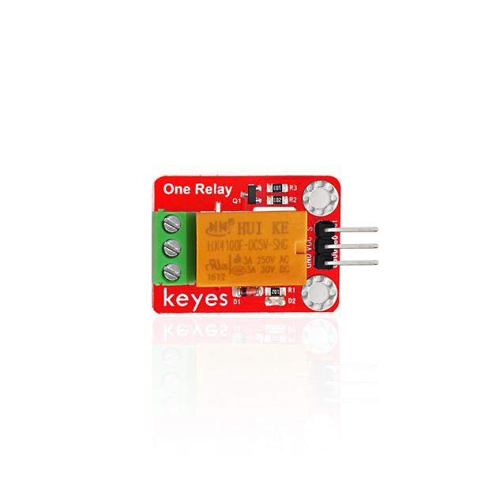
.. |image38| image:: media/852073b6ad9e83c2130d45b7f1565efc.jpeg
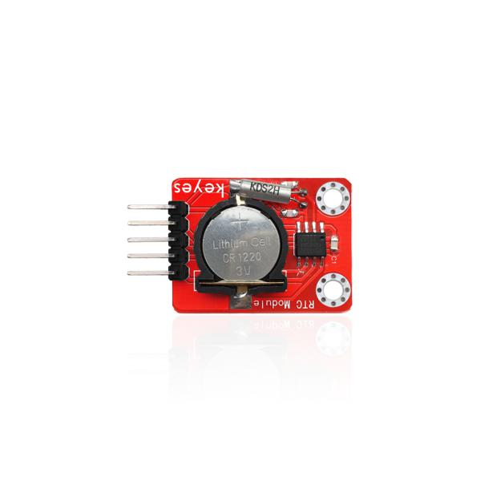
.. |image40| image:: media/b925dc7d677ba8b1077b1251cc1c39e6.jpeg
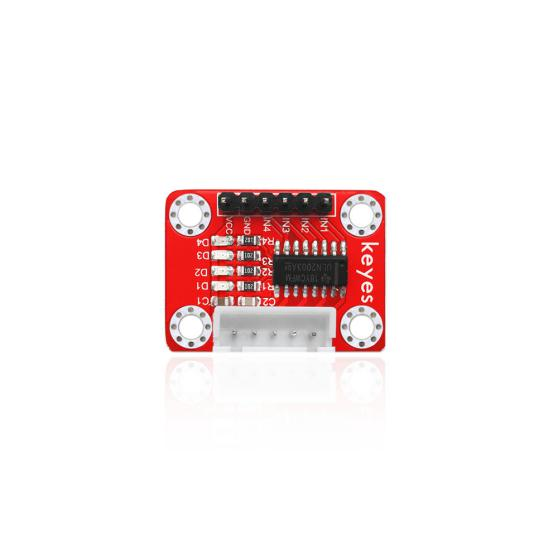
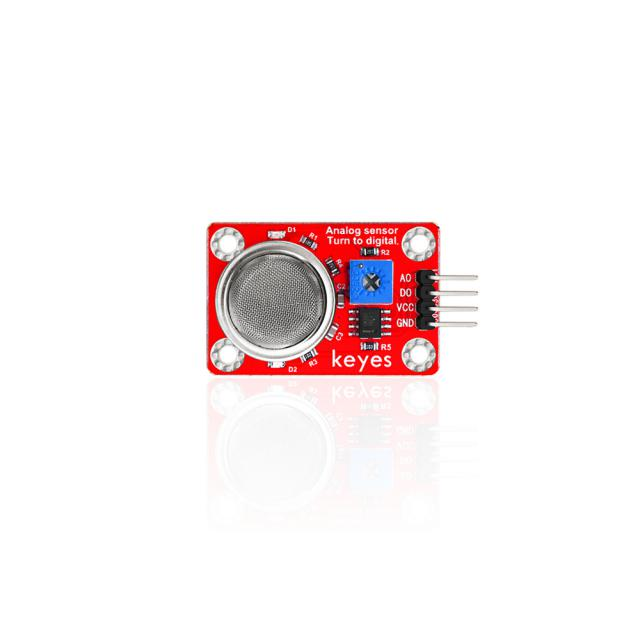
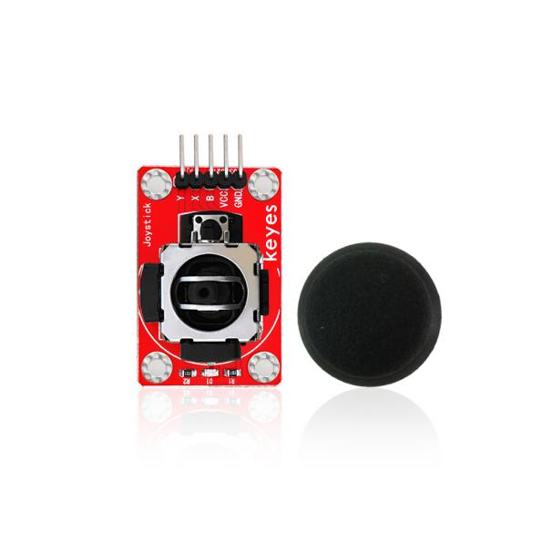
.. |image44| image:: media/51a73fb1094e0c141a3a7c710d969129.jpg
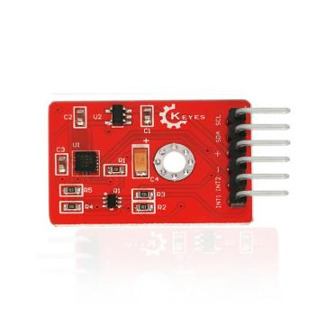
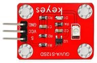
.. |image47| image:: media/87a997f40fe09d5f3bb64b538b9c4562.jpeg
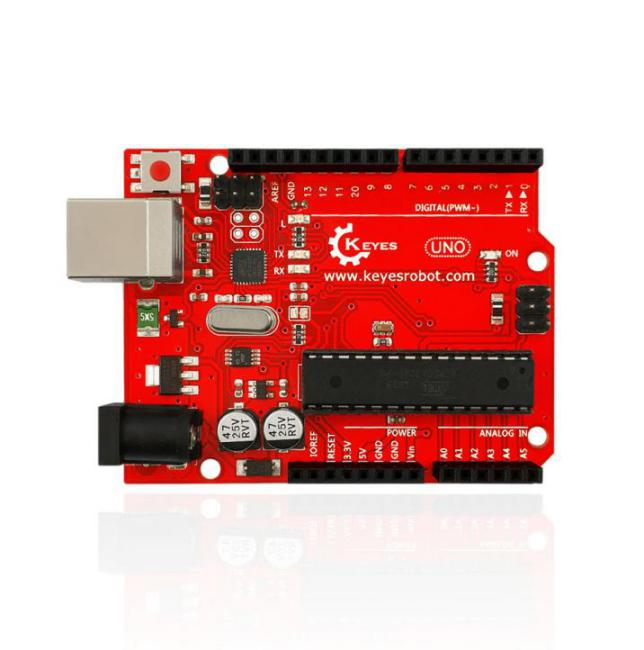
.. |image49| image:: media/4456a83cad7d95811ac569b394aab248.jpeg

.. |image51| image:: media/F5-baifahuang-duan.jpeg
.. |image52| image:: media/F5-baifalan-duan.jpeg
.. |image53| image:: media/4cda5da2c77a5e8f9ee14e21ce171b18.png
.. |image54| image:: media/e595e9dbbd22e6f72867ed8853f21600.png
.. |image55| image:: media/af39238525c3e329c1f7d6f1937c2676.png

.. |image59| image:: media/74HC595DIP.jpeg
.. |image60| image:: media/dianweiqi.jpeg
.. |image61| image:: media/wuyuanfengmingqi.jpeg

.. |image63| image:: media/anjian.jpeg
.. |image64| image:: media/anjian.jpeg

.. |image66| image:: media/guangmindianzu.jpeg

.. |image69| image:: media/gunzhukaiguan.jpeg

.. |image72| image:: media/014fcb7b8de94392fe7e676522bc663a.jpeg

.. |image75| image:: media/c6a4a156298845be8ba0e1f99b01a3c0.jpeg
.. |image76| image:: media/mianbaoxian65.jpeg
.. |image77| image:: media/eb8b3c665dbdae05c80ebac77f9f363c.jpeg
.. |image78| image:: media/92c0c7ace837104963517c3ec5db750d.jpeg
.. |image79| image:: media/da4fd3d4d648c07705dec1dbfb66bcaa.jpeg

.. |image81| image:: media/13c7cbac439470bcc6ab22ce1410ce24.jpeg
.. |image82| image:: media/2eb75448fd3850cfb39a695429d2431f.jpeg

.. |image84| image:: media/9fc0922e2784373238dc169388be6d5b.jpeg
.. |image85| image:: media/5974416b9ece25307371064c01e0e98f.jpeg

.. |image87| image:: media/852073b6ad9e83c2130d45b7f1565efc.jpeg

.. |image89| image:: media/b925dc7d677ba8b1077b1251cc1c39e6.jpeg

.. |image93| image:: media/51a73fb1094e0c141a3a7c710d969129.jpg

.. |image96| image:: media/87a997f40fe09d5f3bb64b538b9c4562.jpeg

.. |image98| image:: media/4456a83cad7d95811ac569b394aab248.jpeg

.. |image100| image:: media/F5-baifahuang-duan.jpeg
.. |image101| image:: media/F5-baifalan-duan.jpeg
.. |image102| image:: media/4cda5da2c77a5e8f9ee14e21ce171b18.png
.. |image103| image:: media/e595e9dbbd22e6f72867ed8853f21600.png
.. |image104| image:: media/af39238525c3e329c1f7d6f1937c2676.png

.. |image108| image:: media/74HC595DIP.jpeg
.. |image109| image:: media/dianweiqi.jpeg
.. |image110| image:: media/wuyuanfengmingqi.jpeg

.. |image112| image:: media/anjian.jpeg
.. |image113| image:: media/anjian.jpeg

.. |image115| image:: media/guangmindianzu.jpeg

.. |image118| image:: media/gunzhukaiguan.jpeg

.. |image121| image:: media/014fcb7b8de94392fe7e676522bc663a.jpeg

.. |image124| image:: media/c6a4a156298845be8ba0e1f99b01a3c0.jpeg
.. |image125| image:: media/mianbaoxian65.jpeg
.. |image126| image:: media/eb8b3c665dbdae05c80ebac77f9f363c.jpeg
.. |image127| image:: media/92c0c7ace837104963517c3ec5db750d.jpeg
.. |image128| image:: media/da4fd3d4d648c07705dec1dbfb66bcaa.jpeg

.. |image130| image:: media/13c7cbac439470bcc6ab22ce1410ce24.jpeg
.. |image131| image:: media/2eb75448fd3850cfb39a695429d2431f.jpeg

.. |image133| image:: media/9fc0922e2784373238dc169388be6d5b.jpeg
.. |image134| image:: media/5974416b9ece25307371064c01e0e98f.jpeg

.. |image136| image:: media/852073b6ad9e83c2130d45b7f1565efc.jpeg

.. |image138| image:: media/b925dc7d677ba8b1077b1251cc1c39e6.jpeg

.. |image142| image:: media/51a73fb1094e0c141a3a7c710d969129.jpg

.. |image145| image:: media/87a997f40fe09d5f3bb64b538b9c4562.jpeg

.. |image147| image:: media/4456a83cad7d95811ac569b394aab248.jpeg
